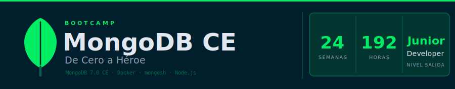

<p align="center">
  
</p>

<p align="center">
  <a href="LICENSE"></a>
  <a href="#"></a>
  <a href="#"></a>
  <a href="https://www.mongodb.com/"></a>
  <a href="https://www.docker.com/"></a>
  <a href="https://nodejs.org/"></a>
  <a href="https://creativecommons.org/licenses/by-nc-sa/4.0/"></a>
</p>

<p align="center">
  <a href="README_EN.md"></a>
</p>

---

## 📋 Descripción

Bootcamp intensivo de **24 semanas (~6 meses)** para dominar MongoDB Community
Edition desde cero. Diseñado para llevar a estudiantes desde ningún conocimiento
en bases de datos NoSQL hasta nivel de **MongoDB Developer Junior** o
**Backend Developer Junior**, con énfasis en modelado de datos real, optimización
de rendimiento y buenas prácticas profesionales.

> 🏛️ **Política de Dominios Únicos (Anticopia)**: Cada aprendiz trabaja un dominio
> de negocio único asignado por el instructor (Biblioteca, Farmacia, Gimnasio,
> Restaurante, Hospital, etc.). Esto garantiza implementaciones originales y
> previene la copia entre compañeros.

### 🎯 Objetivos

Al finalizar el bootcamp, los estudiantes serán capaces de:

- ✅ Comprender el modelo de documentos y colecciones de MongoDB
- ✅ Realizar operaciones CRUD completas con `mongosh` y el driver de Node.js
- ✅ Diseñar esquemas con patrones avanzados (Extended Reference, Bucket, Computed)
- ✅ Construir pipelines de agregación complejos con `$lookup`, `$group`, `$unwind`
- ✅ Crear y gestionar índices para optimizar el rendimiento de consultas
- ✅ Implementar transacciones multi-documento ACID con `withTransaction()`
- ✅ Configurar Replica Sets y entender alta disponibilidad
- ✅ Aplicar mejores prácticas de seguridad (RBAC, `$jsonSchema`, variables de entorno)
- ✅ Integrar MongoDB en aplicaciones Node.js con el driver oficial

### 🚀 ¿Por qué MongoDB Community Edition?

> **MongoDB real desde el día 1** — Sin instalaciones complicadas, MongoDB 7.0
> disponible en minutos con Docker.

Este bootcamp usa MongoDB CE vía Docker en las 24 semanas. Sin Atlas, sin servicios
en la nube. Entorno local reproducible que funciona en Linux, macOS y Windows,
y que puede resetearse en segundos con `docker compose down -v`.

---

## 🗓️ Estructura del Bootcamp

|                      Etapa                      | Semanas | Horas | Temas Principales |
| :----------------------------------------------: | :-----: | :---: | ----------------- |
| **Etapa 0** — Fundamentos de MongoDB             |  01–08  | 64 h  | BSON, CRUD completo, operadores de consulta y actualización, `find()`, índices simples, `explain()` |
| **Etapa 1** — MongoDB Intermedio                 |  09–16  | 64 h  | Aggregation Pipeline, `$lookup`, `$unwind`, índices avanzados, modelado, transacciones |
| **Etapa 2** — MongoDB Avanzado y Node.js         |  17–24  | 64 h  | Replicación, seguridad RBAC, Node.js driver, transacciones ACID, Change Streams, Capstone |

**Total: 24 semanas** | **~192 horas** de formación intensiva

---

## 📚 Contenido por Semana

Cada semana incluye:

```
bootcamp/week-XX/
├── README.md                 # Descripción y objetivos
├── rubrica-evaluacion.md     # Criterios de evaluación
├── 0-assets/                 # Diagramas SVG (tema dark)
├── 1-teoria/                 # Material teórico (.md)
├── 2-practicas/              # Ejercicios guiados
│   └── ejercicio-XX/
│       ├── README.md
│       ├── starter/          # setup.js + ejercicio.js comentado
│       └── solution/         # ejercicio.js descomentado
├── 3-proyecto/               # Proyecto integrador semanal
│   └── starter/
│       ├── setup.js          # Datos de prueba genéricos
│       └── proyecto.js       # TODOs para implementar
├── 4-recursos/               # Ebooks, videografía, webgrafía
└── 5-glosario/               # Términos MongoDB clave (A–Z)
```

### 🔑 Componentes Clave

- 📖 **Teoría**: Conceptos con ejemplos reales ejecutables en `mongosh`
- 💻 **Práctica**: Queries comentadas para descomentar — sin TODOs en ejercicios
- 📝 **Evaluación**: Evidencias de conocimiento, desempeño y producto
- 🎓 **Glosario**: Términos clave de cada semana, ordenados A–Z

---

## 🛠️ Stack Tecnológico

| Tecnología  | Versión | Uso                                       |
| ----------- | ------- | ----------------------------------------- |
| MongoDB CE  | 7.0     | Motor de base de datos (semanas 1–24)     |
| Docker      | 24+     | Contenedor MongoDB reproducible           |
| mongosh     | 2.x     | Shell interactiva para queries y scripts  |
| Node.js     | ≥ 18    | Driver oficial (semanas 23–24)            |
| Git         | 2.30+   | Control de versiones                      |

---

## 🚀 Inicio Rápido

### Prerrequisitos

- **Docker** y **Docker Compose** instalados
- **Git** para clonar el repositorio
- **Node.js ≥ 18** (requerido solo para las semanas 23–24)

### 1. Clonar el Repositorio

```bash
git clone https://github.com/ergrato-dev/bc-mongodb-ce.git
cd bc-mongodb-ce
```

### 2. Levantar MongoDB 7.0

```bash
docker compose -f scripts/docker-compose.yml up -d
```

### 3. Conectar con mongosh

```bash
docker compose -f scripts/docker-compose.yml exec mongodb \
  mongosh -u bootcamp -p bootcamp123 --authenticationDatabase admin bootcamp_db
```

### 4. Cargar datos de prueba (Semana 01)

```bash
docker compose -f scripts/docker-compose.yml exec -T mongodb \
  mongosh -u bootcamp -p bootcamp123 --authenticationDatabase admin \
  bootcamp_db --file /dev/stdin < bootcamp/week-01-introduccion_a_mongodb_y_nosql/2-practicas/ejercicio-01/starter/setup.js
```

---

## 📊 Metodología de Aprendizaje

### Estrategias Didácticas

- 🎯 **Aprendizaje Basado en Proyectos (ABP)**
- 🧩 **Práctica Deliberada** — queries de complejidad creciente
- 🔄 **Repetición Espaciada** — conceptos clave presentes en múltiples semanas
- 👥 **Code Review entre pares**
- 🎮 **Live Coding** con modelado de datos en tiempo real

### Distribución del Tiempo (8 h/semana)

- **Teoría**: 2–2.5 horas
- **Prácticas**: 3–3.5 horas
- **Proyecto**: 2–2.5 horas

### Evaluación

Cada semana incluye tres tipos de evidencias:

1. **Conocimiento 🧠** (30%): Cuestionarios y evaluaciones sobre MongoDB
2. **Desempeño 💪** (40%): Ejercicios prácticos ejecutados correctamente
3. **Producto 📦** (30%): Proyecto entregable adaptado al dominio asignado

**Criterio de aprobación**: Mínimo 70% en cada tipo de evidencia

---

## 🤝 Contribuir

Este proyecto está bajo licencia **CC BY-NC-SA 4.0**: puedes compartirlo y adaptarlo
con atribución, de forma no comercial, y manteniendo la misma licencia.

### Cómo contribuir

1. Haz fork del repositorio
2. Crea tu rama (`git checkout -b feat/nueva-funcionalidad`)
3. Haz commit con [Conventional Commits](https://www.conventionalcommits.org/) (`git commit -m 'feat: add exercise'`)
4. Haz push (`git push origin feat/nueva-funcionalidad`)
5. Abre un Pull Request

### 📋 Áreas de Contribución

- ✨ Ejercicios adicionales
- 📚 Mejoras en documentación
- 🐛 Corrección de errores en queries
- 🎨 Diagramas SVG
- 🌐 Traducciones
- 📹 Recursos de aprendizaje

---

## 📞 Soporte

- 💬 Discussions: [GitHub Discussions](https://github.com/ergrato-dev/bc-mongodb-ce/discussions)
- 🐛 Issues: [GitHub Issues](https://github.com/ergrato-dev/bc-mongodb-ce/issues)
- 📧 Email: [Contacto](mailto:tu-email@ejemplo.com)

---

## 📄 Licencia

Este proyecto está bajo la licencia **CC BY-NC-SA 4.0** (Creative Commons
Atribución-NoComercial-CompartirIgual 4.0 Internacional).

- ✅ Puedes compartir y adaptar el material con atribución
- ✅ Forks educativos permitidos bajo la misma licencia
- ❌ Uso comercial no permitido

Ver [LICENSE](LICENSE) o https://creativecommons.org/licenses/by-nc-sa/4.0/ para más detalles.

---

## 🏆 Agradecimientos

- [MongoDB Docs](https://www.mongodb.com/docs/) — Por la mejor documentación de bases de datos NoSQL
- [MongoDB University](https://learn.mongodb.com/) — Por los cursos gratuitos y certificaciones
- Comunidad MongoDB — Por recursos, ejemplos y soporte en foros
- Todos los contribuidores

---

## 📚 Documentación Adicional

- [🤖 Instrucciones de Copilot](.github/copilot-instructions.md)
- [🔒 Política de Seguridad](SECURITY.md)
- [📋 Plan Curricular](docs/plan-curricular.md)

---

## ⚠️ Exención de Responsabilidad

Este repositorio y todo su contenido se proporcionan **solo con fines educativos**, sin ningún tipo de garantía, expresa o implícita.

- El material, los scripts y los ejemplos de código se ofrecen "tal cual" (*as-is*), sin garantía de idoneidad para ningún propósito particular.
- El uso del contenido de este repositorio en entornos de producción o en sistemas con datos reales es **responsabilidad exclusiva del usuario**.
- Los autores y contribuidores no se hacen responsables de ningún daño directo, indirecto, incidental o consecuente derivado del uso de este material.
- Las credenciales de ejemplo incluidas en los scripts (`bootcamp` / `bootcamp123`) son **exclusivas para entornos locales de aprendizaje** y nunca deben usarse en producción.
- Este proyecto no está afiliado, patrocinado ni avalado por **MongoDB, Inc.**
- Los nombres de productos, marcas y logotipos de terceros son propiedad de sus respectivos dueños.

---

<p align="center">
  <strong>🎓 Bootcamp MongoDB CE — De Cero a Héroe</strong><br>
  <em>De cero a MongoDB Developer Junior en ~6 meses</em>
</p>

<p align="center">
  <a href="bootcamp/week-01-introduccion_a_mongodb_y_nosql">Comenzar Semana 1</a> •
  <a href="docs/plan-curricular.md">Ver Plan Curricular</a> •
  <a href="https://github.com/ergrato-dev/bc-mongodb-ce/issues">Reportar Issue</a> •
  <a href="LICENSE">Licencia CC BY-NC-SA 4.0</a>
</p>

<p align="center">
  Hecho con ❤️ para la comunidad de desarrolladores
</p>
