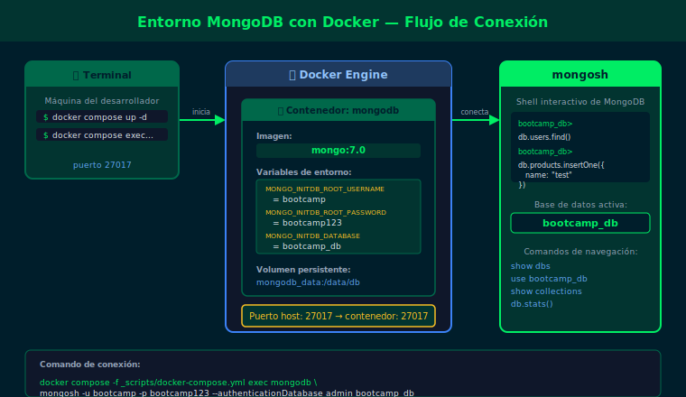

# Semana 01 · 03 — Entorno Docker y mongosh

## Objetivos

- Levantar MongoDB 7.0 CE con Docker Compose
- Conectarse a `mongosh` desde el contenedor
- Navegar bases de datos y colecciones con comandos básicos

---



---

## 1. ¿Por qué Docker?

Docker nos da un entorno idéntico en cualquier sistema operativo.
No necesitas instalar MongoDB directamente en tu máquina ni gestionar versiones.

```bash
# Verificar que Docker está disponible
docker --version
docker compose version
```

---

## 2. Levantar MongoDB 7.0

El archivo `scripts/docker-compose.yml` ya está configurado con MongoDB 7.0 CE.

```bash
# Desde la raíz del repositorio:
docker compose -f scripts/docker-compose.yml up -d

# Verificar que está corriendo (esperar status "healthy"):
docker compose -f scripts/docker-compose.yml ps
```

---

## 3. Conectarse con mongosh

```bash
docker compose -f scripts/docker-compose.yml exec mongodb \
  mongosh -u bootcamp -p bootcamp123 \
  --authenticationDatabase admin bootcamp_db
```

Verás el prompt: `bootcamp_db>`

Para ejecutar un archivo `.js` directamente:

```bash
docker compose -f scripts/docker-compose.yml exec -T mongodb \
  mongosh -u bootcamp -p bootcamp123 --authenticationDatabase admin \
  bootcamp_db --file /dev/stdin < ruta/al/archivo.js
```

---

## 4. Comandos básicos de navegación

```js
// Ver en qué base de datos estás
db

// Listar todas las bases de datos
show dbs

// Cambiar a otra base de datos
use otra_db

// Listar colecciones de la base actual
show collections

// Salir de mongosh
exit
```

---

## ✅ Checklist

- [ ] ¿Pude levantar el contenedor sin errores con `docker compose up -d`?
- [ ] ¿Me conecté correctamente a `mongosh` y vi el prompt `bootcamp_db>`?
- [ ] ¿Sé usar `show dbs` y `show collections`?
- [ ] ¿Entiendo para qué sirve `--authenticationDatabase admin`?

---

## 📚 Referencias

- [MongoDB Docker Hub](https://hub.docker.com/_/mongo)
- [mongosh — Getting Started](https://www.mongodb.com/docs/mongodb-shell/connect/)
