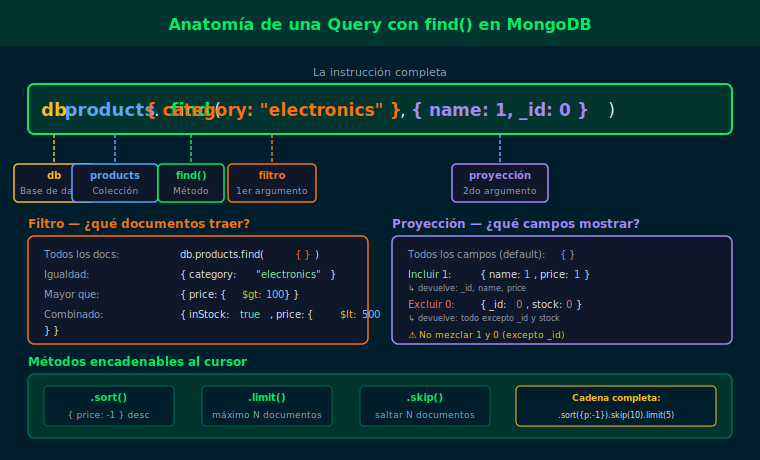

# Semana 01 · 04 — Primeras consultas con find()

## Objetivos

- Leer documentos de una colección con `find()` y `findOne()`
- Aplicar proyecciones para seleccionar solo los campos necesarios
- Controlar el cursor con `.sort()`, `.limit()` y `.skip()`

---



---

## 1. find() — obtener documentos

`find()` retorna un cursor con todos los documentos que coinciden.
Sin argumentos equivale a `SELECT * FROM tabla` en SQL.

```js
// Obtener todos los productos
db.products.find()

// Con filtro básico (se profundiza en semana 03)
db.products.find({ category: "laptops" })
```

---

## 2. findOne() — obtener un documento

Retorna solo el **primer** documento que coincide. Ideal cuando se espera un único resultado.

```js
// Primer documento de la colección
db.products.findOne()

// Primer producto de una categoría
db.products.findOne({ category: "laptops" })
```

---

## 3. Proyecciones — elegir campos

El segundo argumento controla qué campos se devuelven.

```js
// Incluir solo name y price (1 = incluir, _id se muestra por defecto)
db.products.find({}, { name: 1, price: 1, _id: 0 })

// Excluir campos (0 = excluir)
db.products.find({}, { specs: 0, tags: 0, createdAt: 0 })
```

> No mezcles `1` y `0` en el mismo objeto de proyección, excepto para `_id`.

---

## 4. Métodos de cursor

```js
// Ordenar por precio descendente
db.products.find().sort({ price: -1 })

// Limitar a 5 resultados
db.products.find().limit(5)

// Paginación: saltar los primeros 3 y mostrar los siguientes 5
db.products.find().skip(3).limit(5)

// Contar documentos en la colección
db.products.countDocuments()
```

---

## ✅ Checklist

- [ ] ¿Puedo usar `find()` para leer todos los documentos de una colección?
- [ ] ¿Sé la diferencia entre `find()` y `findOne()`?
- [ ] ¿Puedo escribir una proyección que incluya solo 2 campos y oculte `_id`?
- [ ] ¿Sé cómo limitar y ordenar resultados con `.limit()` y `.sort()`?

---

## 📚 Referencias

- [db.collection.find()](https://www.mongodb.com/docs/manual/reference/method/db.collection.find/)
- [Project Fields from Query Results](https://www.mongodb.com/docs/manual/tutorial/project-fields-from-query-results/)
