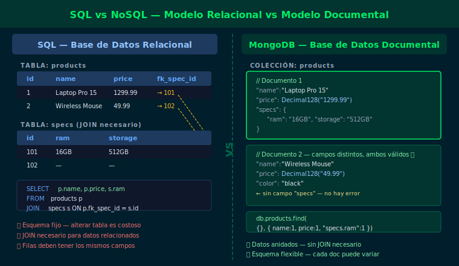
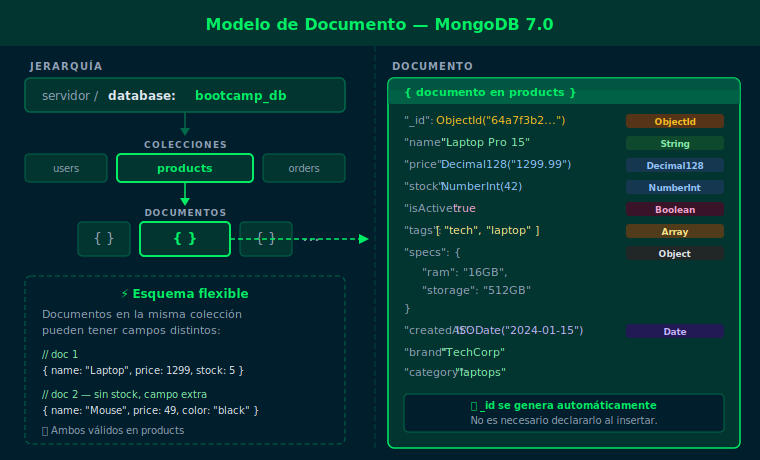
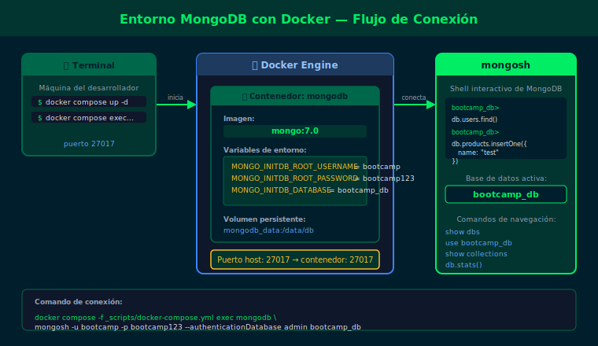

# Semana 01 — Introducción a MongoDB y NoSQL

## Objetivos

- Comprender qué es MongoDB y en qué se diferencia de las bases de datos relacionales
- Configurar el entorno de trabajo con Docker y conectarse a `mongosh`
- Identificar los componentes clave: documentos, colecciones y tipos BSON básicos
- Ejecutar las primeras consultas con `find()` y `findOne()`

## Diagrama

| Asset | Concepto |
|-------|----------|
|  | Modelo relacional vs documental |
|  | Estructura de documentos y tipos BSON |
|  | Entorno Docker y conexión mongosh |
|  | Anatomía de una query find() |

## Contenido

| # | Archivo | Tema |
| - | ------- | ---- |
| 1 | [01-sql-vs-nosql.md](1-teoria/01-sql-vs-nosql.md) | SQL vs NoSQL — cuándo usar cada uno |
| 2 | [02-documentos-colecciones-bson.md](1-teoria/02-documentos-colecciones-bson.md) | Documentos, colecciones y tipos BSON |
| 3 | [03-docker-setup.md](1-teoria/03-docker-setup.md) | Entorno Docker y primeros pasos con mongosh |
| 4 | [04-primeras-queries.md](1-teoria/04-primeras-queries.md) | Primeras consultas con `find()` y `findOne()` |

## Prácticas

| # | Ejercicio | Descripción |
| - | --------- | ----------- |
| 1 | [ejercicio-01](2-practicas/ejercicio-01/) | Explorar documentos con `find()` y proyecciones |
| 2 | [ejercicio-02](2-practicas/ejercicio-02/) | Filtrar con operadores básicos de comparación |

## Proyecto

[Proyecto Semana 01 →](3-proyecto/README.md) — Primer esquema de documento adaptado al dominio asignado.

## Distribución del Tiempo

| Actividad  | Tiempo estimado |
| ---------- | --------------- |
| Teoría     | 2.5h            |
| Prácticas  | 3h              |
| Proyecto   | 2.5h            |
| **Total**  | **8h**          |

## Cómo ejecutar

1. Asegúrate de tener Docker corriendo
2. Levanta el contenedor:
   ```bash
   docker compose -f _scripts/docker-compose.yml up -d
   ```
3. Carga los datos de prueba:
   ```bash
   docker compose -f _scripts/docker-compose.yml exec -T mongodb \
     mongosh -u bootcamp -p bootcamp123 --authenticationDatabase admin \
     bootcamp_db --file /dev/stdin < 2-practicas/ejercicio-01/starter/setup.js
   ```
4. Conecta e interactúa:
   ```bash
   docker compose -f _scripts/docker-compose.yml exec mongodb \
     mongosh -u bootcamp -p bootcamp123 --authenticationDatabase admin bootcamp_db
   ```

## Navegación

| ← Anterior | Inicio | Siguiente → |
| ---------- | ------ | ----------- |
| — | [bootcamp/](../) | [Semana 02](../week-02/README.md) |
