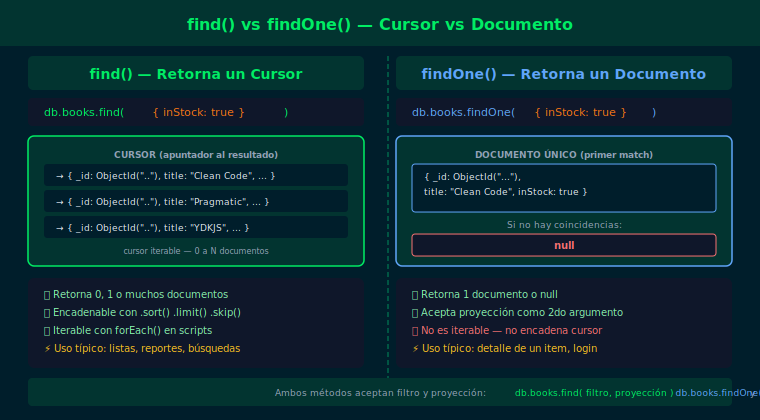

# Semana 02 · 02 — find() y findOne()

## Objetivos

- Entender que `find()` retorna un cursor iterable, no una lista de documentos
- Usar `findOne()` cuando solo se necesita el primer resultado
- Construir filtros básicos de igualdad para ambos métodos



---

## 1. find() — cursor iterable

`find()` no retorna documentos directamente: retorna un **cursor** que apunta
al resultado. `mongosh` lo itera automáticamente y muestra los primeros 20.

```js
// Todos los libros de la colección
db.books.find()

// Solo libros en stock
db.books.find({ inStock: true })

// Libros de un autor específico
db.books.find({ author: "Robert C. Martin" })
```

El filtro `{}` vacío equivale a "sin restricciones" → retorna todos los documentos.

---

## 2. findOne() — primer documento o null

`findOne()` retorna el **primer documento** que coincide con el filtro, o `null`
si no hay coincidencias. Útil cuando se espera exactamente un resultado.

```js
// Primer libro del catálogo
db.books.findOne()

// Buscar un libro específico
db.books.findOne({ title: "Clean Code" })
// Retorna: { _id: ObjectId("..."), title: "Clean Code", ... }

// Buscar algo que no existe
db.books.findOne({ title: "Libro Inexistente" })
// Retorna: null
```

---

## 3. Diferencias clave

| | `find()` | `findOne()` |
|---|---|---|
| Retorna | Cursor (0 a N docs) | Documento o `null` |
| Uso típico | Listas, múltiples resultados | Detalle de un item |
| Iterable | Sí | No |

---

## 4. Filtros de igualdad

Cualquier campo puede usarse como filtro. La igualdad es implícita.

```js
// Leer libros publicados en 2008
db.books.find({ year: NumberInt(2008) })

// Leer libros con múltiples condiciones de igualdad (AND implícito)
db.books.find({ year: NumberInt(2008), inStock: true })
```

> Los filtros por múltiples campos forman un **AND implícito**: el documento
> debe cumplir TODAS las condiciones para aparecer en el resultado.

---

## ✅ Checklist

- [ ] ¿Puedo explicar qué es un cursor y por qué `find()` retorna uno?
- [ ] ¿Sé cuándo usar `findOne()` en lugar de `find().limit(1)`?
- [ ] ¿Entiendo qué devuelve `findOne()` cuando no hay coincidencias?
- [ ] ¿Puedo filtrar documentos con múltiples condiciones de igualdad?

---

## 📚 Referencias

- [db.collection.find()](https://www.mongodb.com/docs/manual/reference/method/db.collection.find/)
- [db.collection.findOne()](https://www.mongodb.com/docs/manual/reference/method/db.collection.findOne/)
