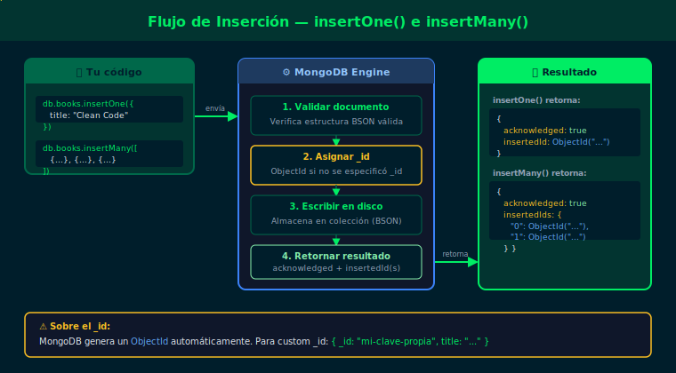
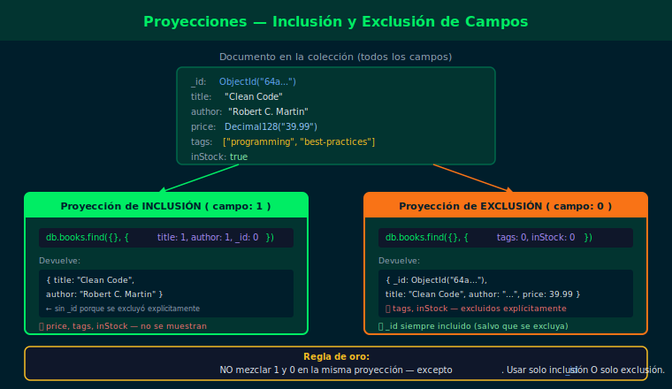
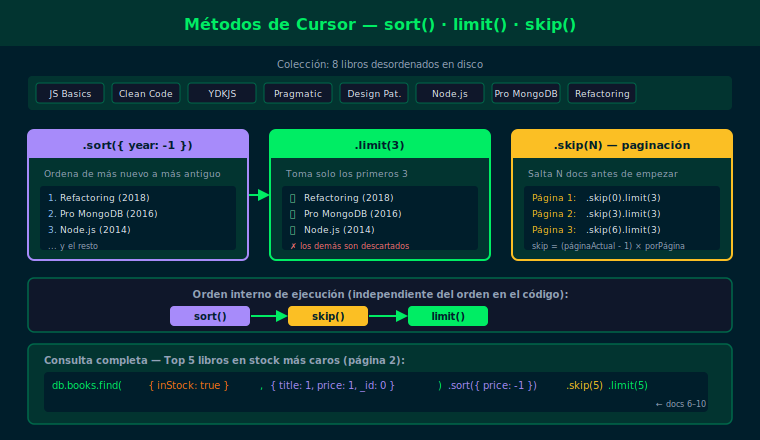

# Semana 02 — CRUD I: Inserción y Lectura

## Objetivos

- Insertar documentos individuales y en lote con `insertOne()` e `insertMany()`
- Leer documentos con `find()` y `findOne()` entendiendo la diferencia entre cursor y documento
- Controlar qué campos devuelve una consulta mediante proyecciones
- Encadenar `.sort()`, `.limit()` y `.skip()` para paginar resultados

## Diagrama

| Asset | Concepto |
|-------|----------|
|  | Flujo de insertOne e insertMany con _id automático |
|  | Cursor iterable vs documento único |
|  | Inclusión y exclusión de campos |
|  | Encadenamiento sort → skip → limit |

## Contenido

| # | Archivo | Tema |
| - | ------- | ---- |
| 1 | [01-insercion-documentos.md](1-teoria/01-insercion-documentos.md) | `insertOne()` e `insertMany()` — insertar con seguridad |
| 2 | [02-find-findone.md](1-teoria/02-find-findone.md) | `find()` vs `findOne()` — cursor y documento único |
| 3 | [03-proyecciones.md](1-teoria/03-proyecciones.md) | Proyecciones — seleccionar solo los campos necesarios |
| 4 | [04-cursor-metodos.md](1-teoria/04-cursor-metodos.md) | Métodos de cursor: `.sort()`, `.limit()`, `.skip()` |

## Prácticas

| # | Ejercicio | Descripción |
| - | --------- | ----------- |
| 1 | [ejercicio-01](2-practicas/ejercicio-01/) | Insertar documentos con `insertOne()` e `insertMany()` |
| 2 | [ejercicio-02](2-practicas/ejercicio-02/) | Leer con proyecciones y métodos de cursor |

## Proyecto

[Proyecto Semana 02 →](3-proyecto/README.md) — Poblar y consultar la colección principal de tu dominio asignado.

## Distribución del Tiempo

| Actividad  | Tiempo estimado |
| ---------- | --------------- |
| Teoría     | 2h              |
| Prácticas  | 3.5h            |
| Proyecto   | 2.5h            |
| **Total**  | **8h**          |

## Cómo ejecutar

1. Asegúrate de tener Docker corriendo
2. Levanta el contenedor:
   ```bash
   docker compose -f _scripts/docker-compose.yml up -d
   ```
3. Carga los datos de prueba:
   ```bash
   docker compose -f _scripts/docker-compose.yml exec -T mongodb \
     mongosh -u bootcamp -p bootcamp123 --authenticationDatabase admin \
     bootcamp_db --file /dev/stdin < 2-practicas/ejercicio-01/starter/setup.js
   ```
4. Conecta e interactúa:
   ```bash
   docker compose -f _scripts/docker-compose.yml exec mongodb \
     mongosh -u bootcamp -p bootcamp123 --authenticationDatabase admin bootcamp_db
   ```

## Navegación

| ← Anterior | Inicio | Siguiente → |
| ---------- | ------ | ----------- |
| [Semana 01](../week-01/README.md) | [bootcamp/](../) | [Semana 03](../week-03/README.md) |
