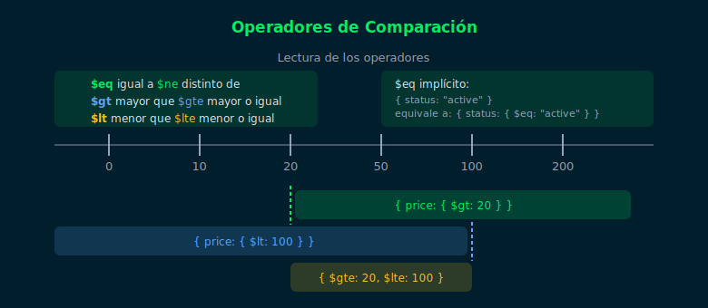
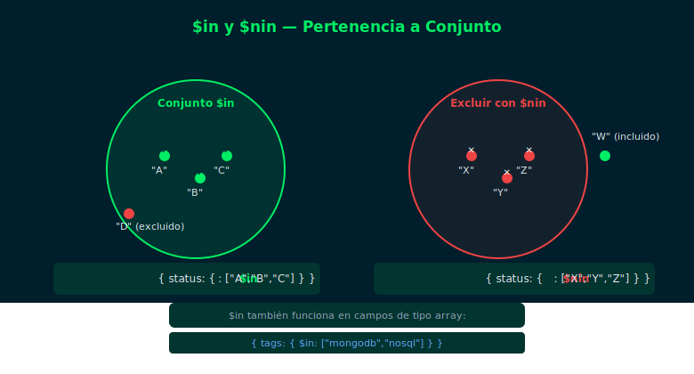
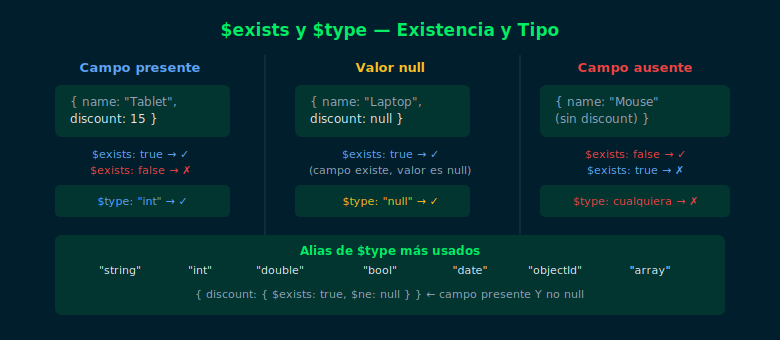
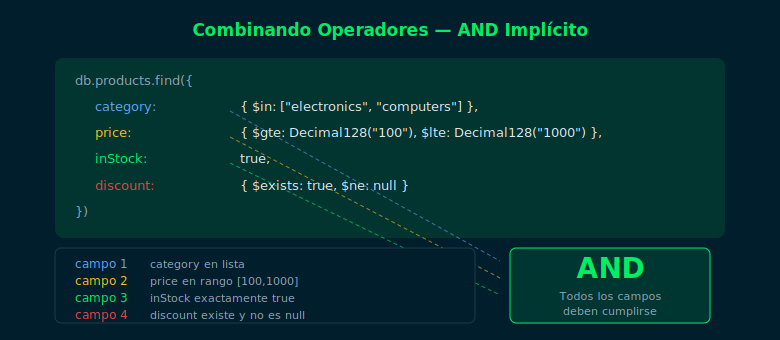

# Semana 03 — CRUD II: Operadores de Consulta

## Objetivos

- Filtrar documentos con operadores de comparación: `$eq`, `$ne`, `$gt`, `$lt`, `$gte`, `$lte`
- Seleccionar por pertenencia a un conjunto con `$in` y `$nin`
- Verificar existencia y tipo de campo con `$exists` y `$type`
- Combinar múltiples operadores en una sola query

## Diagrama

| Asset | Concepto |
|-------|----------|
|  | $eq, $ne, $gt, $lt, $gte, $lte |
|  | $in y $nin — pertenencia a conjuntos |
|  | $exists y $type — campos opcionales |
|  | AND implícito y múltiples condiciones |

## Contenido

| # | Archivo | Tema |
| - | ------- | ---- |
| 1 | [01-operadores-comparacion.md](1-teoria/01-operadores-comparacion.md) | Operadores de comparación numérica y de texto |
| 2 | [02-operadores-in-nin.md](1-teoria/02-operadores-in-nin.md) | `$in` y `$nin` — filtrar por lista de valores |
| 3 | [03-operadores-elemento.md](1-teoria/03-operadores-elemento.md) | `$exists` y `$type` — presencia y tipo de campo |
| 4 | [04-combinando-operadores.md](1-teoria/04-combinando-operadores.md) | Combinar operadores — AND implícito |

## Prácticas

| # | Ejercicio | Descripción |
| - | --------- | ----------- |
| 1 | [ejercicio-01](2-practicas/ejercicio-01/) | Filtrar con operadores de comparación |
| 2 | [ejercicio-02](2-practicas/ejercicio-02/) | Filtrar con $in, $nin, $exists y $type |

## Proyecto

[Proyecto Semana 03 →](3-proyecto/README.md) — Consultas de filtrado sobre la colección de tu dominio.

## Distribución del Tiempo

| Actividad  | Tiempo estimado |
| ---------- | --------------- |
| Teoría     | 2h              |
| Prácticas  | 3.5h            |
| Proyecto   | 2.5h            |
| **Total**  | **8h**          |

## Cómo ejecutar

1. Levanta el contenedor:
   ```bash
   docker compose -f _scripts/docker-compose.yml up -d
   ```
2. Carga los datos de prueba:
   ```bash
   docker compose -f _scripts/docker-compose.yml exec -T mongodb \
     mongosh -u bootcamp -p bootcamp123 --authenticationDatabase admin \
     bootcamp_db --file /dev/stdin < 2-practicas/ejercicio-01/starter/setup.js
   ```
3. Conecta e interactúa:
   ```bash
   docker compose -f _scripts/docker-compose.yml exec mongodb \
     mongosh -u bootcamp -p bootcamp123 --authenticationDatabase admin bootcamp_db
   ```

## Navegación

| ← Anterior | Inicio | Siguiente → |
| ---------- | ------ | ----------- |
| [Semana 02](../week-02-crud_i_insercion_y_lectura/README.md) | [bootcamp/](../) | [Semana 04](../week-04-operadores_logicos_y_de_array/README.md) |
