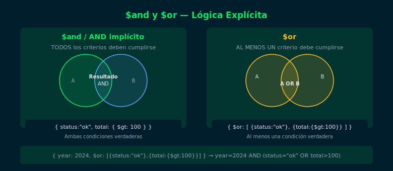

# Semana 04 · 01 — `$and` y `$or` Explícitos

## Objetivos

- Entender cuándo usar `$and` explícito vs AND implícito
- Construir queries con `$or` para condiciones alternativas
- Combinar `$and` y `$or` en queries complejas



---

## 1. AND implícito vs `$and` explícito

El AND implícito (múltiples campos en el filtro) cubre la mayoría de los casos.
Usa `$and` explícito solo cuando necesitas aplicar múltiples condiciones
al **mismo campo** con operadores incompatibles en un objeto:

```js
// AND implícito — suficiente para campos distintos
db.orders.find({
  status: "shipped",
  total: { $gte: 100 }
})

// $and explícito — necesario para expresiones complejas en el mismo campo
db.orders.find({
  $and: [
    { total: { $gte: 100 } },
    { total: { $ne: 150 } }
  ]
})
```

---

## 2. Operador `$or`

`$or` acepta un array de condiciones. El documento coincide si cumple
**al menos una**:

```js
// Pedidos enviados O con total alto
db.orders.find({
  $or: [
    { status: "shipped" },
    { total: { $gt: 500 } }
  ]
})
```

---

## 3. Combinar `$or` con otras condiciones

```js
// Pedidos de 2024 Y (enviados O con total > 300)
db.orders.find({
  year: 2024,
  $or: [
    { status: "shipped" },
    { total: { $gt: 300 } }
  ]
})
```

---

## 4. `$or` vs `$in` — cuándo preferir cada uno

```js
// ✅ Preferir $in cuando el mismo campo tiene múltiples valores
db.products.find({ category: { $in: ["electronics", "accessories"] } })

// Usar $or cuando las condiciones involucran campos o operadores distintos
db.products.find({
  $or: [
    { category: "electronics" },
    { price: { $lt: Decimal128("20") } }
  ]
})
```

---

## ✅ Checklist

- [ ] ¿Sé cuándo `$and` explícito es necesario vs AND implícito?
- [ ] ¿Puedo construir una query con `$or` de 3 o más alternativas?
- [ ] ¿Entiendo la diferencia de rendimiento entre `$or` y `$in`?
- [ ] ¿Sé combinar `$or` con condiciones de campo fijas?

---

## 📚 Referencias

- [Logical Query Operators](https://www.mongodb.com/docs/manual/reference/operator/query-logical/)
- [Query and Projection Operators](https://www.mongodb.com/docs/manual/reference/operator/query/)
