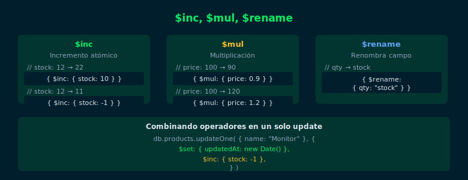

# Semana 05 · 02 — `$inc`, `$mul`, `$rename`

## Objetivos

- Incrementar o decrementar valores numéricos con `$inc`
- Multiplicar valores con `$mul`
- Renombrar campos con `$rename`



---

## 1. Operador `$inc`

Incrementa un campo numérico en el valor especificado. Valores negativos
funcionan como decremento:

```js
// Aumentar el stock en 10 unidades
db.products.updateOne(
  { name: "Wireless Mouse" },
  { $inc: { stock: NumberInt(10) } }
)

// Decrementar en 1 (venta de un producto)
db.products.updateOne(
  { _id: ObjectId("…") },
  { $inc: { stock: NumberInt(-1) } }
)
```

> `$inc` es atómico: en entornos concurrentes, es más seguro que leer el
> valor, calcular y volver a escribir.

---

## 2. Múltiples operadores en un solo update

Se pueden combinar operadores en el mismo `updateOne()`:

```js
// Actualizar precio, reducir stock y marcar última modificación
db.products.updateOne(
  { name: "4K Monitor 27\"" },
  {
    $set: {
      price: Decimal128("429.00"),
      updatedAt: new Date()
    },
    $inc: { stock: NumberInt(-1) }
  }
)
```

---

## 3. Operador `$mul`

Multiplica el valor del campo por el factor especificado:

```js
// Aplicar 10% de descuento a todos los productos de audio
db.products.updateMany(
  { category: "audio" },
  { $mul: { price: Decimal128("0.9") } }
)
```

---

## 4. Operador `$rename`

Renombra un campo en el documento:

```js
// Renombrar "qty" a "stock" en todos los documentos
db.products.updateMany(
  { qty: { $exists: true } },
  { $rename: { qty: "stock" } }
)
```

---

## ✅ Checklist

- [ ] ¿Entiendo que `$inc` es atómico y seguro para contadores?
- [ ] ¿Puedo combinar `$set` + `$inc` en un solo `updateOne()`?
- [ ] ¿Sé cómo aplicar `$mul` para cambios porcentuales de precio?
- [ ] ¿Puedo usar `$rename` para migrar nombres de campo?

---

## 📚 Referencias

- [Update Operators Reference](https://www.mongodb.com/docs/manual/reference/operator/update/)
