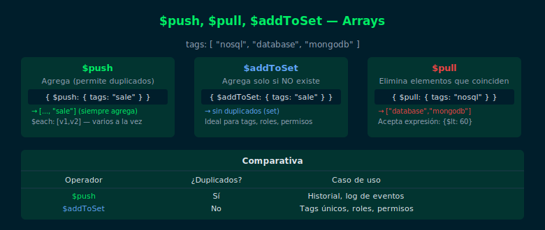

# Semana 05 · 03 — `$push`, `$pull`, `$addToSet`

## Objetivos

- Agregar elementos a arrays con `$push` y `$addToSet`
- Eliminar elementos de arrays con `$pull`
- Entender la diferencia entre `$push` y `$addToSet`



---

## 1. Operador `$push`

Agrega un elemento al final del array (permite duplicados):

```js
// Agregar un tag
db.products.updateOne(
  { name: "Laptop Pro 15" },
  { $push: { tags: "bestseller" } }
)

// Agregar múltiples elementos con $each
db.products.updateOne(
  { name: "Laptop Pro 15" },
  { $push: { tags: { $each: ["sale", "featured"] } } }
)
```

---

## 2. Operador `$addToSet`

Agrega un elemento solo si NO existe ya en el array (sin duplicados):

```js
// Solo agrega "wireless" si no está ya en tags
db.products.updateOne(
  { name: "Gaming Headset" },
  { $addToSet: { tags: "wireless" } }
)
```

| | Duplicados | Uso ideal |
|---|---|---|
| `$push` | Permite | Listas donde se acepta repetición |
| `$addToSet` | No permite | Conjuntos únicos (tags, roles) |

---

## 3. Operador `$pull`

Elimina todos los elementos del array que coincidan con la condición:

```js
// Quitar el tag "budget" del array
db.products.updateOne(
  { name: "Budget Mouse" },
  { $pull: { tags: "budget" } }
)

// Quitar todos los scores menores a 60
db.students.updateMany(
  {},
  { $pull: { scores: { $lt: 60 } } }
)
```

---

## 4. Operador `$pop`

Elimina el primer (`-1`) o último (`1`) elemento del array:

```js
// Quitar el último elemento
db.products.updateOne(
  { _id: ObjectId("…") },
  { $pop: { tags: 1 } }
)
```

---

## ✅ Checklist

- [ ] ¿Sé cuándo usar `$push` vs `$addToSet`?
- [ ] ¿Puedo agregar múltiples elementos con `$each`?
- [ ] ¿Puedo usar `$pull` con una expresión de condición (ej: `{ $lt: 60 }`)?
- [ ] ¿Entiendo que `$pop` elimina por posición, no por valor?

---

## 📚 Referencias

- [Array Update Operators](https://www.mongodb.com/docs/manual/reference/operator/update-array/)
