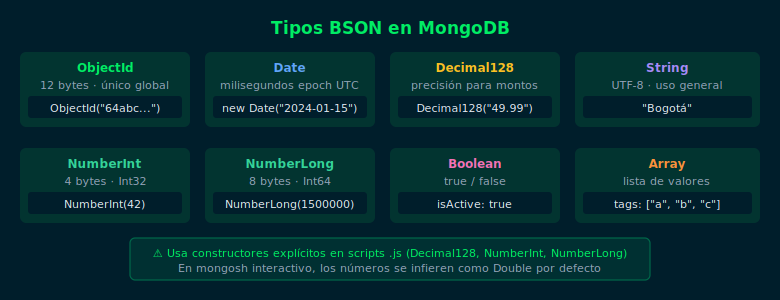

# 01 — Tipos BSON: ObjectId, Date y Decimal128

## Objetivos

- Comprender qué es BSON y por qué MongoDB no usa JSON puro
- Usar `ObjectId`, `Date` y `Decimal128` correctamente
- Consultar documentos por tipo con el operador `$type`

## Diagrama



## 1. ¿Qué es BSON?

BSON (Binary JSON) es el formato de almacenamiento de MongoDB.
Extiende JSON con tipos adicionales para mayor precisión y eficiencia.
Los documentos se almacenan en BSON pero se muestran como JSON.

## 2. ObjectId

`ObjectId` es el tipo por defecto del campo `_id`. Es un valor de 12 bytes
que garantiza unicidad global sin coordinación central:

```js
// MongoDB genera _id automáticamente
db.employees.insertOne({ name: "Ana Torres", department: "Engineering" })

// Consultar por ObjectId
db.employees.findOne({ _id: ObjectId("64abc1234567890123456789") })

// Extraer la fecha de creación del ObjectId
ObjectId("64abc1234567890123456789").getTimestamp()
```

## 3. Date

Almacena fechas como número de milisegundos desde epoch (UTC):

```js
db.employees.insertOne({
  name: "Luis Mora",
  hireDate: new Date("2023-03-15"),
  birthDate: new Date("1990-07-22"),
  lastLogin: new Date()
})

// Buscar contratados después de 2023-01-01
db.employees.find({
  hireDate: { $gte: new Date("2023-01-01") }
})
```

## 4. Decimal128

Para valores monetarios, usa `Decimal128` en lugar de `Number` (float):

```js
// ✅ Precisión exacta para montos
db.products.insertOne({
  name: "Premium Plan",
  price: Decimal128("49.99"),
  tax: Decimal128("9.50")
})

// ❌ Float puede tener errores de precisión
// price: 49.99  →  puede ser 49.990000000000000001
```

> MongoDB 7.0 soporta `Decimal128` nativamente en `mongosh`.

## 5. Consultar por tipo con $type

```js
// Verificar qué documentos tienen precio como Decimal128
db.products.find({ price: { $type: "decimal" } })

// Buscar campos fecha
db.employees.find({ hireDate: { $type: "date" } })
```

## Checklist

- ¿Puedes crear un documento con `ObjectId`, `Date` y `Decimal128`?
- ¿Sabes por qué `Decimal128("49.99")` es mejor que `49.99` para precios?
- ¿Puedes extraer la timestamp de un `ObjectId`?
- ¿Sabes usar `$type` para filtrar por tipo de campo?

## Referencias

- [BSON Types — MongoDB Docs](https://www.mongodb.com/docs/manual/reference/bson-types/)
- [ObjectId — MongoDB Docs](https://www.mongodb.com/docs/manual/reference/method/ObjectId/)
