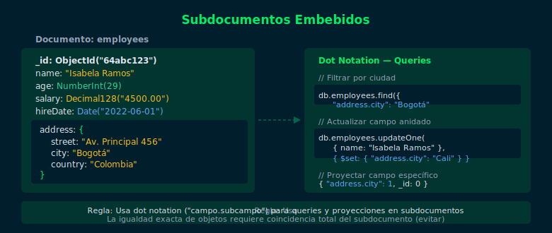

# 03 — Subdocumentos y Dot Notation

## Objetivos

- Modelar entidades complejas con subdocumentos embebidos
- Acceder a campos anidados con dot notation
- Actualizar campos dentro de subdocumentos

## Diagrama



## 1. ¿Qué es un subdocumento?

Un subdocumento es un documento anidado dentro de otro campo.
MongoDB no limita la profundidad de anidamiento (recomendado: máximo 3 niveles).

```js
// Documento con subdocumento "address"
db.employees.insertOne({
  name: "Isabela Ramos",
  email: "isabela@company.com",
  address: {
    street: "Av. Principal 456",
    city: "Bogotá",
    country: "Colombia",
    zipCode: "110011"
  }
})
```

## 2. Dot Notation — Acceso a campos anidados

Para consultar o proyectar campos dentro de subdocumentos se usa punto (`.`):

```js
// Filtrar por ciudad dentro de address
db.employees.find({ "address.city": "Bogotá" })

// Proyectar solo el campo city del subdocumento
db.employees.find(
  { "address.country": "Colombia" },
  { name: 1, "address.city": 1, _id: 0 }
)
```

## 3. Subdocumentos con múltiples niveles

```js
db.employees.insertOne({
  name: "Pedro Castillo",
  contact: {
    phone: {
      mobile: "+57 300 123 4567",
      office: "+57 1 234 5678"
    },
    social: {
      linkedin: "pcastillo"
    }
  }
})

// Dot notation a 2 niveles
db.employees.find(
  {},
  { name: 1, "contact.phone.mobile": 1, _id: 0 }
)
```

## 4. Actualizar campos de subdocumentos

```js
// $set con dot notation para actualizar un campo anidado
db.employees.updateOne(
  { name: "Isabela Ramos" },
  { $set: { "address.city": "Medellín", "address.zipCode": "050001" } }
)

// Agregar un nuevo campo al subdocumento
db.employees.updateOne(
  { name: "Isabela Ramos" },
  { $set: { "address.province": "Antioquia" } }
)
```

## 5. Cuándo usar subdocumentos

✅ Usa subdocumento cuando los datos siempre se leen juntos (address).
✅ Usa subdocumento para datos que son parte intrínseca del documento padre.
❌ No subligas datos que cambien con mucha frecuencia de forma independiente.
❌ No anides más de 3-4 niveles sin razón justificada.

## Checklist

- ¿Puedes crear un documento con un subdocumento de 2 niveles?
- ¿Sabes usar dot notation para filtrar por un campo anidado?
- ¿Puedes actualizar solo un campo dentro de un subdocumento con `$set`?
- ¿Sabes proyectar un campo específico de un subdocumento?

## Referencias

- [Embedded Documents](https://www.mongodb.com/docs/manual/core/data-model-design/)
- [Dot Notation](https://www.mongodb.com/docs/manual/core/document/#dot-notation)
