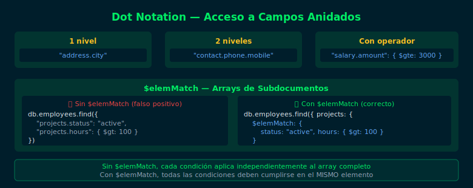

# 04 — Consultas en Documentos Anidados

## Objetivos

- Realizar consultas con operadores en campos de subdocumentos
- Usar `$elemMatch` para arrays de subdocumentos
- Combinar dot notation con operadores de comparación

## Diagrama



## 1. Operadores de comparación con dot notation

```js
// Empleados con más de 5 años de experiencia en su skillset anidado
db.employees.find({
  "performance.score": { $gte: 8 }
})

// Empleados en Colombia con salario mayor a 3000
db.employees.find({
  "address.country": "Colombia",
  "salary.amount": { $gt: Decimal128("3000") }
})
```

## 2. $elemMatch en arrays de subdocumentos

Cuando un array contiene subdocumentos, `$elemMatch` garantiza que
todas las condiciones apliquen al **mismo elemento** del array:

```js
// Empleados con al menos un proyecto en estado "active"
// con más de 100 horas registradas
db.employees.find({
  projects: {
    $elemMatch: { status: "active", hoursLogged: { $gt: 100 } }
  }
})

// ❌ Sin $elemMatch: cada condición aplica a CUALQUIER elemento
// (puede dar falsos positivos)
db.employees.find({
  "projects.status": "active",
  "projects.hoursLogged": { $gt: 100 }
})
```

## 3. Proyección en arrays de subdocumentos

```js
// Mostrar solo el primer proyecto que coinceda ($ operator)
db.employees.find(
  { "projects.status": "active" },
  { name: 1, "projects.$": 1, _id: 0 }
)
```

## 4. Consultas de igualdad exacta en subdocumentos

La igualdad exacta requiere que el subdocumento coincida completamente
(mismo orden de campos):

```js
// ✅ Dot notation — busca por campo específico (recomendado)
db.employees.find({ "address.city": "Bogotá" })

// ❌ Igualdad de objeto — requiere coincidencia exacta del subdocumento
db.employees.find({
  address: { city: "Bogotá", country: "Colombia" }
  // falla si hay más campos en address
})
```

> **Regla**: Siempre usa dot notation para consultar campos dentro de subdocumentos.

## Checklist

- ¿Sabes la diferencia entre dot notation y igualdad de subdocumentos?
- ¿Puedes usar `$elemMatch` para buscar en un array de subdocumentos?
- ¿Entiendes por qué el orden importa en la igualdad exacta?
- ¿Puedes combinar dot notation con `$gte`, `$lt` u otros operadores?

## Referencias

- [Query on Embedded Documents](https://www.mongodb.com/docs/manual/tutorial/query-embedded-documents/)
- [$elemMatch (query)](https://www.mongodb.com/docs/manual/reference/operator/query/elemMatch/)
