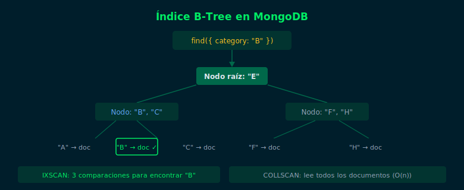

# 01 — ¿Qué es un Índice? Estructura B-Tree

## Objetivos

- Entender por qué los índices aceleran las consultas
- Comprender la estructura B-Tree que usa MongoDB
- Identificar cuándo MongoDB hace COLLSCAN sin índice

## Diagrama



## 1. El problema sin índice

Sin índice, MongoDB debe leer todos los documentos de la colección
(COLLSCAN — Collection Scan) para encontrar los que coinciden:

```
Colección: 1,000,000 documentos
Query: db.users.find({ email: "ana@test.com" })
Sin índice: lee los 1,000,000 documentos → lento
Con índice: salta directo al documento → rápido (microsegundos)
```

## 2. La estructura B-Tree

MongoDB usa árboles B (B-Tree) para sus índices. El árbol mantiene
los valores ordenados, permitiendo búsqueda binaria:

- **Hoja**: contiene el valor del campo indexado + puntero al documento
- **Nodo interno**: valor separador que guía hacia el subárbol correcto
- **Profundidad logarítmica**: buscar entre 1M documentos toma ~20 comparaciones

## 3. Índice por defecto: _id

MongoDB crea automáticamente un índice único en `_id` para cada colección.
No se puede eliminar:

```js
// Este índice ya existe en TODAS las colecciones
{ _id: 1 }
```

## 4. ¿Cuándo crear un índice?

✅ Campos usados frecuentemente en `find()` con filtros
✅ Campos usados en `.sort()` para ordenamiento
✅ Campos que deben ser únicos (`email`, `username`)
❌ No indexar campos con muy poca cardinalidad (ej: `isActive` booleano)
❌ Evitar índices en colecciones pequeñas (overhead no justificado)

## 5. Costo de los índices

Los índices no son gratuitos. Cada `insertOne()`, `updateOne()` y `deleteOne()`
debe actualizar también los índices asociados. En colecciones con muchas
escrituras, demasiados índices pueden degradar el rendimiento de escritura.

> Para MongoDB 7.0, el número máximo de índices por colección es 64.

## Checklist

- ¿Sabes qué es un COLLSCAN y por qué es lento en colecciones grandes?
- ¿Puedes explicar cómo un B-Tree acelera las búsquedas?
- ¿Entiendes el tradeoff escritura lenta vs lectura rápida con índices?
- ¿Sabes qué índice crea MongoDB automáticamente en cada colección?

## Referencias

- [Indexes — MongoDB Docs](https://www.mongodb.com/docs/manual/indexes/)
- [Index Concepts](https://www.mongodb.com/docs/manual/core/indexes/index-types/)
