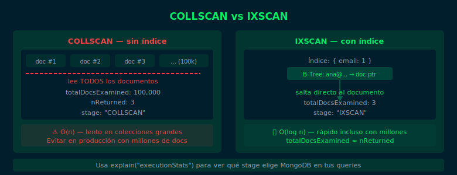

# 02 — createIndex(), dropIndex(), getIndexes()

## Objetivos

- Crear índices simples ascendentes y descendentes
- Listar los índices de una colección con `getIndexes()`
- Eliminar índices con `dropIndex()` y `dropIndexes()`

## Diagrama



## 1. createIndex() — Crear un índice simple

```js
// Índice ascendente (1) en el campo email
db.users.createIndex({ email: 1 })

// Índice descendente (-1) en createdAt
// Útil para ordenar del más reciente al más antiguo
db.users.createIndex({ createdAt: -1 })

// Con opciones: nombre personalizado
db.users.createIndex({ username: 1 }, { name: "users_username_asc" })
```

> `1` = ascendente, `-1` = descendente. Para índices simples, la dirección
> solo importa en consultas de ordenamiento.

## 2. getIndexes() — Listar índices existentes

```js
// Listar todos los índices de la colección
db.users.getIndexes()

// Resultado esperado:
// [
//   { key: { _id: 1 }, name: "_id_" },        ← automático
//   { key: { email: 1 }, name: "email_1" }     ← creado por nosotros
// ]
```

## 3. dropIndex() — Eliminar un índice

```js
// Por nombre del índice
db.users.dropIndex("email_1")

// Por definición del campo
db.users.dropIndex({ email: 1 })

// Eliminar todos los índices excepto _id
db.users.dropIndexes()
```

## 4. Opciones comunes de createIndex()

```js
// Índice único: no permite valores duplicados
db.users.createIndex({ email: 1 }, { unique: true })

// Índice con nombre explícito
db.users.createIndex(
  { category: 1 },
  { name: "products_category_asc" }
)

// background: true (deprecated en 4.4+, se construye en background por default)
```

## 5. Nomenclatura de índices por defecto

Si no se especifica `name`, MongoDB genera: `campo_dirección`:
- `{ email: 1 }` → índice se llama `email_1`
- `{ createdAt: -1 }` → índice se llama `createdAt_-1`

## Checklist

- ¿Puedes crear un índice ascendente en un campo de texto?
- ¿Sabes listar los índices de una colección con `getIndexes()`?
- ¿Puedes eliminar un índice por nombre y por definición?
- ¿Entiendes cuándo usar el índice único (`unique: true`)?

## Referencias

- [createIndex()](https://www.mongodb.com/docs/manual/reference/method/db.collection.createIndex/)
- [dropIndex()](https://www.mongodb.com/docs/manual/reference/method/db.collection.dropIndex/)
