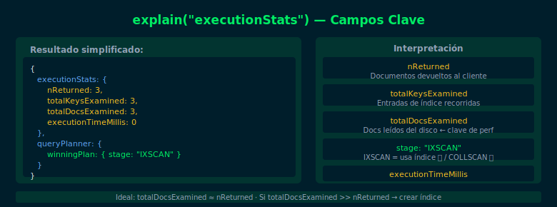

# 03 — explain() — Analizando Planes de Ejecución

## Objetivos

- Usar `explain("executionStats")` para analizar queries
- Interpretar los campos clave: `winningPlan`, `nReturned`, `totalDocsExamined`
- Distinguir entre COLLSCAN (malo) e IXSCAN (bueno)

## Diagrama



## 1. Sintaxis de explain()

```js
// Modo básico — solo muestra el plan elegido
db.users.find({ email: "ana@test.com" }).explain()

// Modo recomendado — muestra estadísticas de ejecución reales
db.users.find({ email: "ana@test.com" }).explain("executionStats")
```

## 2. Campos clave del resultado

```js
// Resultado simplificado de explain("executionStats"):
{
  executionStats: {
    nReturned: 1,             // documentos devueltos
    totalKeysExamined: 1,     // entradas de índice examinadas
    totalDocsExamined: 1,     // documentos leídos del disco
    executionTimeMillis: 0    // tiempo de ejecución
  },
  queryPlanner: {
    winningPlan: {
      stage: "IXSCAN",        // ← usa índice (bueno)
      // o
      stage: "COLLSCAN"       // ← sin índice (malo en tablas grandes)
    }
  }
}
```

## 3. Interpretar COLLSCAN vs IXSCAN

| Campo                | COLLSCAN (sin índice) | IXSCAN (con índice) |
|----------------------|-----------------------|---------------------|
| `stage`              | `"COLLSCAN"`          | `"IXSCAN"`          |
| `totalDocsExamined`  | = total documentos    | = documentos devueltos |
| `totalKeysExamined`  | 0                     | ≥ 1                 |
| Rendimiento          | Lento (O(n))          | Rápido (O(log n))   |

## 4. Señales de alerta en explain()

```js
// ❌ Señal de alerta: examina muchos más documentos de los que devuelve
{
  nReturned: 5,
  totalDocsExamined: 100000  // examina 100k para devolver solo 5
}

// ✅ Uso eficiente: examina aproximadamente los mismos que devuelve
{
  nReturned: 5,
  totalDocsExamined: 5       // índice preciso, sin desperdicio
}
```

## Checklist

- ¿Puedes ejecutar `explain("executionStats")` sobre una query?
- ¿Sabes identificar si una query usa COLLSCAN o IXSCAN?
- ¿Entiendes qué significa que `totalDocsExamined` sea mucho mayor que `nReturned`?
- ¿Puedes crear el índice correcto para convertir un COLLSCAN en IXSCAN?

## Referencias

- [explain() — MongoDB Docs](https://www.mongodb.com/docs/manual/reference/method/cursor.explain/)
- [Explain Results](https://www.mongodb.com/docs/manual/reference/explain-results/)
