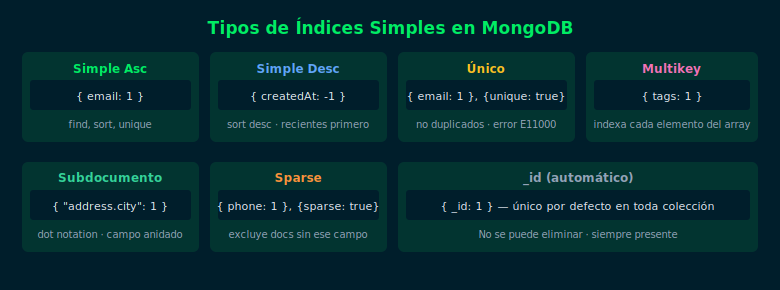

# 04 — Índices Únicos e Índices en Arrays

## Objetivos

- Crear índices únicos para garantizar integridad de datos
- Comprender cómo MongoDB indexa campos de tipo array (multikey)
- Conocer las limitaciones de los índices multikey

## Diagrama



## 1. Índice único

Garantiza que no existan dos documentos con el mismo valor en el campo:

```js
// Crear índice único en email
db.users.createIndex({ email: 1 }, { unique: true })

// Intentar insertar email duplicado → error
db.users.insertOne({ email: "ana@test.com" })
// MongoServerError: E11000 duplicate key error

// Índice único en campo que puede ser null (sparse)
db.users.createIndex(
  { phone: 1 },
  { unique: true, sparse: true }
)
// sparse: true — excluye del índice los documentos sin ese campo
```

## 2. Índice multikey (arrays)

Cuando se crea un índice sobre un campo que contiene un array, MongoDB
crea una entrada de índice por cada elemento del array:

```js
// Documento con array
{ name: "Laptop", tags: ["electronics", "portable", "new"] }

// Índice en campo de array
db.products.createIndex({ tags: 1 })
// MongoDB crea 3 entradas: "electronics", "portable", "new"

// La query usa el índice multikey correctamente
db.products.find({ tags: "portable" })
```

## 3. Limitaciones del índice multikey

```js
// ❌ No se puede usar $elemMatch con operadores de rango en multikey compuesto
// Limitación: solo 1 campo de array por índice compuesto
// (se verá en la semana de índices avanzados)

// ✅ Para queries simples en arrays, el índice multikey funciona perfectamente
db.products.find({ tags: { $in: ["electronics", "portable"] } })
```

## 4. Índice en campos de subdocumentos

```js
// Crear índice en campo anidado usando dot notation
db.employees.createIndex({ "address.city": 1 })

// Ahora esta query usa el índice
db.employees.find({ "address.city": "Bogotá" })
```

## Checklist

- ¿Sabes crear un índice único y qué error se produce con duplicados?
- ¿Entiendes qué es un índice multikey y cuándo se crea automáticamente?
- ¿Puedes crear un índice en un campo de subdocumento con dot notation?
- ¿Conoces el uso de `sparse: true` para campos opcionales?

## Referencias

- [Unique Indexes](https://www.mongodb.com/docs/manual/core/index-unique/)
- [Multikey Indexes](https://www.mongodb.com/docs/manual/core/index-multikey/)
