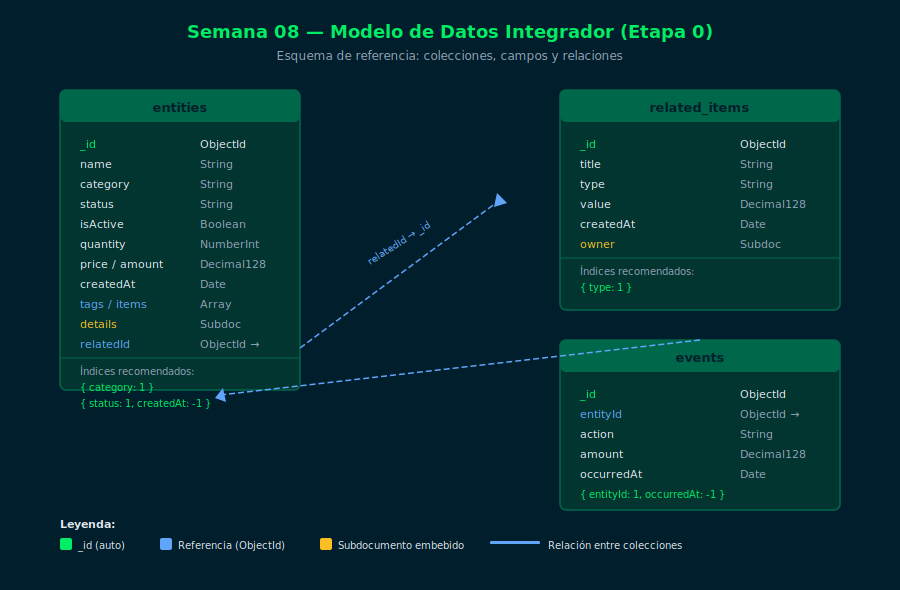

# Semana 08 — Proyecto Integrador Etapa 0

## ¿De qué trata esta semana?

La semana 08 es el **proyecto integrador de la Etapa 0**. No hay teoría nueva.
El objetivo es consolidar y aplicar todo lo aprendido en las semanas 01–07:

- Inserción de documentos con tipos BSON correctos
- Consultas con operadores de comparación, lógicos y de arrays
- Operaciones de actualización y eliminación
- Diseño de índices y análisis con `explain()`

## Objetivos de Aprendizaje

1. Diseñar un esquema de documentos coherente para un dominio real
2. Implementar CRUD completo con `mongosh`
3. Crear consultas que usen operadores aprendidos en las semanas anteriores
4. Optimizar al menos una query con `createIndex()` y verificar con `explain()`

## Diagrama



## Distribución del Tiempo

| Actividad | Tiempo estimado |
|---|---|
| Revisión de rúbrica y planificación | 1 h |
| Diseño del esquema (colecciones, campos, tipos) | 1.5 h |
| Implementación de CRUD completo | 2.5 h |
| Consultas con operadores avanzados | 1.5 h |
| Índices y análisis con explain() | 1 h |
| Revisión y entrega | 0.5 h |
| **Total** | **8 h** |

## Estructura

```
week-08/
├── README.md
├── rubrica-evaluacion.md
├── 0-assets/
│   └── 01-schema-overview.svg
├── 3-proyecto/
│   ├── README.md
│   └── starter/
│       ├── setup.js
│       └── proyecto.js
├── 4-recursos/
│   └── README.md
└── 5-glosario/
    └── README.md
```

> No hay `1-teoria/` ni `2-practicas/` esta semana — es 100% proyecto.

## Navegación

| | Enlace |
|---|---|
| ← Semana anterior | [Semana 07 — Índices Básicos](../week-07/README.md) |
| → Semana siguiente | [Semana 09 — Aggregation Pipeline I](../week-09/README.md) |
| Inicio | [Bootcamp MongoDB](../../README.md) |
