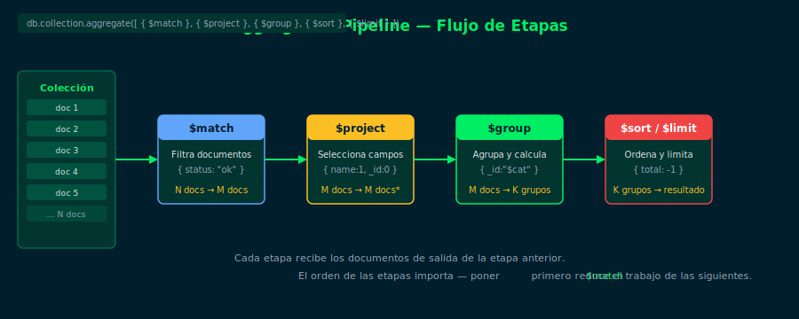

# 01 — ¿Qué es la Aggregation Pipeline?

## Objetivos

- Entender qué es la Aggregation Pipeline y para qué sirve
- Comprender cómo los documentos fluyen entre etapas
- Diferenciar `aggregate()` de `find()`

## Diagrama



## 1. ¿Por qué no alcanza con find()?

`find()` devuelve documentos *tal como están* en la colección.
No puede calcular totales, promedios ni transformar la forma de los datos.

La **Aggregation Pipeline** permite hacer eso:

```js
// find() — devuelve documentos completos
db.orders.find({ status: "completed" })

// aggregate() — transforma y resume datos
db.orders.aggregate([
  { $match: { status: "completed" } },
  { $group: { _id: "$city", total: { $sum: "$amount" } } },
  { $sort: { total: -1 } }
])
```

## 2. ¿Cómo funciona un pipeline?

Un pipeline es un **array de etapas**. MongoDB ejecuta cada etapa en orden,
pasando los documentos de salida de una etapa a la entrada de la siguiente.

```
Colección → [ $match ] → [ $group ] → [ $sort ] → resultado
```

Cada etapa decide qué documentos pasan, cómo se transforman o cómo se agrupan.

## 3. Etapas principales de esta semana

| Etapa | ¿Qué hace? |
|---|---|
| `$match` | Filtra documentos (como `find()`) |
| `$project` | Selecciona y renombra campos |
| `$sort` | Ordena documentos |
| `$limit` | Limita el número de documentos |
| `$skip` | Salta N documentos |
| `$group` | Agrupa y calcula valores |

## 4. Regla de oro: $match primero

Coloca siempre `$match` lo más temprano posible en el pipeline. Reduce el
volumen de datos que procesan las etapas siguientes.

```js
// ✅ Bien — $match reduce documentos antes de $group
db.orders.aggregate([
  { $match: { status: "completed" } },
  { $group: { _id: "$city", total: { $sum: "$amount" } } }
])

// ❌ Mal — $group procesa todos los documentos innecesariamente
db.orders.aggregate([
  { $group: { _id: "$city", total: { $sum: "$amount" } } },
  { $match: { status: "completed" } }
])
```

## Checklist

- [ ] ¿Qué diferencia hay entre `find()` y `aggregate()`?
- [ ] ¿Por qué los documentos "fluyen" de una etapa a la siguiente?
- [ ] ¿Cuál etapa conviene poner primero y por qué?
- [ ] ¿Qué hace `$group` con los documentos que recibe?

## Referencias

- [Aggregation Pipeline — MongoDB Docs](https://www.mongodb.com/docs/manual/aggregation/)
- [Aggregation Pipeline Stages](https://www.mongodb.com/docs/manual/reference/operator/aggregation-pipeline/)
