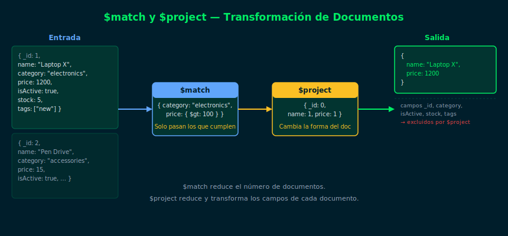

# 02 — $match y $project

## Objetivos

- Usar `$match` para filtrar documentos dentro de un pipeline
- Usar `$project` para seleccionar, excluir y calcular campos
- Combinar ambas etapas en un pipeline

## Diagrama



## 1. $match — Filtrar documentos

`$match` acepta los mismos operadores de consulta que `find()`:

```js
// Filtra productos activos con precio mayor a 100
db.products.aggregate([
  {
    $match: {
      isActive: true,
      price: { $gt: Decimal128("100.00") }
    }
  }
])
```

Dentro de `$match` puedes usar `$and`, `$or`, `$in`, `$elemMatch`, etc.

## 2. $project — Seleccionar campos

`$project` controla qué campos aparecen en los documentos de salida:

```js
// Incluir campos específicos (1 = incluir, 0 = excluir)
db.products.aggregate([
  { $match: { isActive: true } },
  {
    $project: {
      _id: 0,
      name: 1,
      price: 1,
      category: 1
    }
  }
])
```

> Solo puedes mezclar inclusiones o exclusiones en un mismo `$project`.
> Excepción: `_id: 0` siempre se puede agregar.

## 3. Campos calculados en $project

`$project` puede crear campos nuevos con expresiones:

```js
db.products.aggregate([
  {
    $project: {
      name: 1,
      price: 1,
      // Campo calculado: precio con descuento del 10%
      discountedPrice: {
        $multiply: [{ $toDouble: "$price" }, 0.9]
      },
      // Renombrar un campo existente
      productCategory: "$category"
    }
  }
])
```

## 4. Combinar $match + $project

```js
db.products.aggregate([
  { $match: { category: "electronics", isActive: true } },
  {
    $project: {
      _id: 0,
      name: 1,
      category: 1,
      price: 1
    }
  }
])
```

## Checklist

- [ ] ¿`$match` acepta `$gt`, `$in` y `$and`? ¿Es igual que en `find()`?
- [ ] ¿Qué pasa si pones `_id: 0` en `$project`?
- [ ] ¿Cómo se crea un campo nuevo con `$project`?
- [ ] ¿Por qué conviene poner `$match` antes que `$project`?

## Referencias

- [$match — MongoDB Docs](https://www.mongodb.com/docs/manual/reference/operator/aggregation/match/)
- [$project — MongoDB Docs](https://www.mongodb.com/docs/manual/reference/operator/aggregation/project/)
