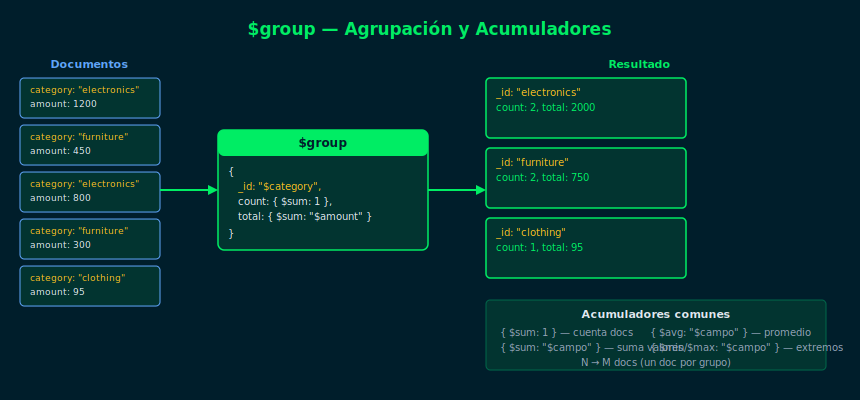

# 04 — $group

## Objetivos

- Agrupar documentos por un campo con `$group`
- Usar acumuladores `$sum` y `$count` para calcular totales
- Entender el campo `_id` dentro de `$group`

## Diagrama



## 1. Estructura de $group

`$group` requiere obligatoriamente el campo `_id`:

```js
db.orders.aggregate([
  {
    $group: {
      _id: "$category",       // campo por el que se agrupa
      total: { $sum: 1 }      // acumulador
    }
  }
])
```

- `_id: "$campo"` — agrupa por el valor del campo
- `_id: null` — agrupa TODOS los documentos en uno solo

## 2. Acumuladores básicos

| Acumulador | Operación |
|---|---|
| `{ $sum: 1 }` | Cuenta documentos del grupo |
| `{ $sum: "$campo" }` | Suma los valores del campo |
| `{ $avg: "$campo" }` | Promedio de los valores |
| `{ $min: "$campo" }` | Valor mínimo |
| `{ $max: "$campo" }` | Valor máximo |

```js
// Ventas totales por categoría
db.orders.aggregate([
  { $match: { status: "completed" } },
  {
    $group: {
      _id: "$category",
      totalOrders: { $sum: 1 },
      totalRevenue: { $sum: { $toDouble: "$amount" } }
    }
  },
  { $sort: { totalRevenue: -1 } }
])
```

## 3. Agrupar por múltiples campos

Usa un subdocumento en `_id` para agrupar por más de un campo:

```js
db.orders.aggregate([
  {
    $group: {
      _id: { category: "$category", status: "$status" },
      count: { $sum: 1 }
    }
  }
])
```

## 4. Contar todos los documentos

```js
// Total de documentos en la colección
db.products.aggregate([
  { $group: { _id: null, total: { $sum: 1 } } }
])
```

## Checklist

- [ ] ¿Qué pasa si `_id` en `$group` es `null`?
- [ ] ¿`{ $sum: 1 }` cuenta documentos o suma valores?
- [ ] ¿Cómo agrupar por dos campos al mismo tiempo?
- [ ] ¿Cuál etapa debería ir antes de `$group` para optimizar?

## Referencias

- [$group — MongoDB Docs](https://www.mongodb.com/docs/manual/reference/operator/aggregation/group/)
- [Aggregation Accumulators](https://www.mongodb.com/docs/manual/reference/operator/aggregation/group/#accumulators-group)
