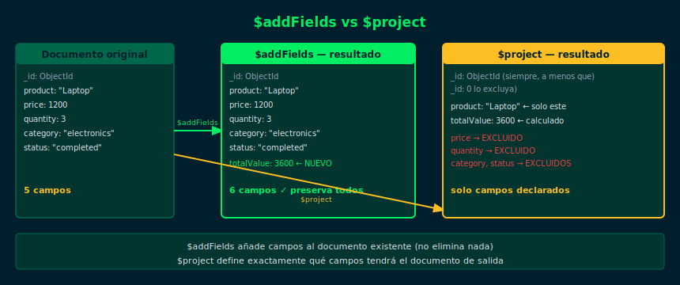

# 02 — $addFields

## Objetivos

- Agregar campos calculados a los documentos sin modificar los existentes
- Entender la diferencia entre `$addFields` y `$project`
- Combinar `$addFields` con expresiones aritméticas

## Diagrama



## 1. ¿Qué hace $addFields?

`$addFields` agrega uno o más campos nuevos a cada documento.
A diferencia de `$project`, **mantiene todos los campos existentes**:

```js
// $project — reemplaza el documento con solo los campos especificados
db.sales.aggregate([
  { $project: { product: 1, amount: 1, totalValue: { $multiply: [{ $toDouble: "$amount" }, "$quantity"] } } }
])

// $addFields — agrega el campo calculado SIN eliminar los demás
db.sales.aggregate([
  { $addFields: { totalValue: { $multiply: [{ $toDouble: "$amount" }, "$quantity"] } } }
])
```

## 2. Agregar múltiples campos

```js
db.sales.aggregate([
  {
    $addFields: {
      // Campo calculado
      totalValue: { $multiply: [{ $toDouble: "$amount" }, "$quantity"] },
      // Campo derivado de un campo existente
      year: { $year: "$saleDate" },
      // Campo estático
      currency: "COP"
    }
  }
])
```

## 3. Sobreescribir un campo existente

`$addFields` también puede modificar el valor de un campo que ya existe:

```js
// Convierte amount de Decimal128 a Double para facilitar cálculos
db.sales.aggregate([
  { $addFields: { amount: { $toDouble: "$amount" } } },
  { $group: { _id: "$category", total: { $sum: "$amount" } } }
])
```

## Checklist

- [ ] ¿`$addFields` elimina campos existentes? ¿Y `$project`?
- [ ] ¿Puedes agregar un campo de fecha calculado del tipo `$year`?
- [ ] ¿Se puede usar `$addFields` para sobreescribir un campo?
- [ ] ¿Qué etapa va primero si necesitas filtrar antes de calcular?

## Referencias

- [$addFields — MongoDB Docs](https://www.mongodb.com/docs/manual/reference/operator/aggregation/addFields/)
- [Arithmetic Expressions](https://www.mongodb.com/docs/manual/reference/operator/aggregation-arithmetic/)
