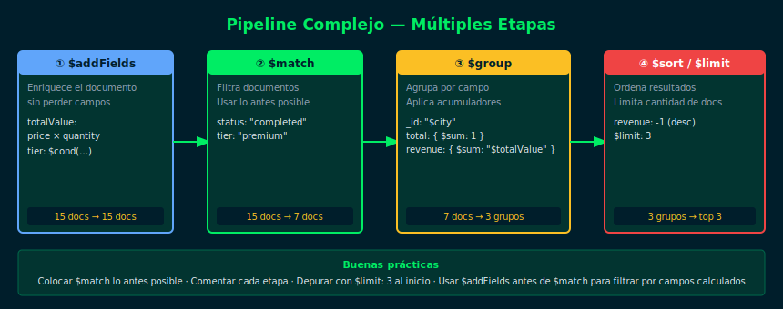

# 04 — Pipelines Complejos

## Objetivos

- Encadenar 4 o más etapas en un pipeline coherente
- Combinar `$addFields`, `$group`, `$cond` y `$sort` en un análisis real
- Entender cuándo dividir un pipeline complejo en partes

## Diagrama



## 1. Patron: Enriquecer → Filtrar → Agrupar → Ordenar

```js
db.sales.aggregate([
  // Etapa 1: Agregar campo calculado
  {
    $addFields: {
      totalValue: { $multiply: [{ $toDouble: "$amount" }, "$quantity"] },
      priceLabel: {
        $cond: [{ $gt: [{ $toDouble: "$amount" }, 500] }, "premium", "standard"]
      }
    }
  },
  // Etapa 2: Filtrar
  { $match: { status: "completed", priceLabel: "premium" } },
  // Etapa 3: Agrupar con múltiples acumuladores
  {
    $group: {
      _id: "$category",
      salesCount: { $sum: 1 },
      totalRevenue: { $sum: "$totalValue" },
      products: { $addToSet: "$product" },
      topSalesperson: { $first: "$salesperson" }
    }
  },
  // Etapa 4: Ordenar
  { $sort: { totalRevenue: -1 } }
])
```

## 2. Buenas prácticas

- Comenta cada etapa — facilita la lectura y el debugging
- Prueba el pipeline parcialmente: agrega etapas de una en una
- Usa `$match` lo más temprano posible para reducir documentos
- Evita más de 6-7 etapas; divide en múltiples queries si es necesario

## 3. Debugging de un pipeline

Ejecuta el pipeline hasta la etapa que quieres verificar y agrega
un `$limit: 3` temporal al final para revisar la estructura:

```js
db.sales.aggregate([
  { $addFields: { totalValue: { $multiply: [{ $toDouble: "$amount" }, "$quantity"] } } },
  { $limit: 3 }   // temporal para debugging
])
```

## Checklist

- [ ] ¿Puedes leer el pipeline de arriba a abajo y entender qué hace cada etapa?
- [ ] ¿El `$match` está antes del `$group`?
- [ ] ¿Probaste el pipeline etapa por etapa con `$limit: 3`?
- [ ] ¿Los campos calculados en `$addFields` están disponibles en etapas siguientes?

## Referencias

- [Optimize Aggregation Pipeline](https://www.mongodb.com/docs/manual/core/aggregation-pipeline-optimization/)
- [Practical MongoDB Aggregations](https://www.practical-mongodb-aggregations.com/)
