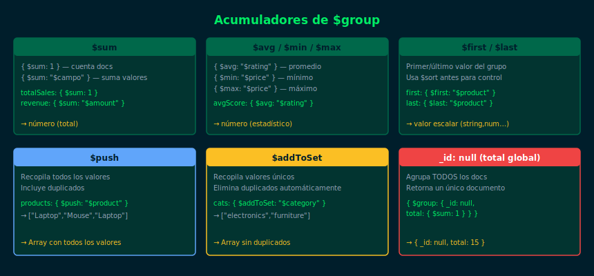

# Semana 10 — Aggregation Pipeline II: Acumuladores Avanzados

## ¿De qué trata esta semana?

Profundizamos en los **acumuladores** de `$group` e introducimos operadores
de expresión para manipular campos dentro de `$project` y `$addFields`.

## Objetivos de Aprendizaje

1. Usar `$first`, `$last`, `$push` y `$addToSet` en `$group`
2. Aplicar `$addFields` para enriquecer documentos sin reemplazar campos
3. Usar expresiones condicionales `$cond` e `$ifNull`
4. Combinar múltiples etapas en pipelines de análisis complejos

## Diagrama



## Distribución del Tiempo

| Actividad | Tiempo estimado |
|---|---|
| Teoría: $first, $last, $push, $addToSet | 2 h |
| Ejercicio 01: acumuladores en $group | 1.5 h |
| Ejercicio 02: $addFields y $cond | 1.5 h |
| Proyecto semanal | 2 h |
| Revisión y entrega | 1 h |
| **Total** | **8 h** |

## Estructura

```
week-10/
├── README.md
├── rubrica-evaluacion.md
├── 0-assets/
│   ├── 01-accumulators.svg
│   ├── 02-addfields.svg
│   ├── 03-cond-ifnull.svg
│   └── 04-pipeline-complex.svg
├── 1-teoria/
│   ├── 01-first-last-push.md
│   ├── 02-addfields.md
│   ├── 03-cond-ifnull.md
│   └── 04-pipeline-complejo.md
├── 2-practicas/
│   ├── ejercicio-01/
│   └── ejercicio-02/
├── 3-proyecto/
├── 4-recursos/
└── 5-glosario/
```

## Navegación

| | Enlace |
|---|---|
| ← Semana anterior | [Semana 09 — Aggregation Pipeline I](../week-09/README.md) |
| → Semana siguiente | [Semana 11 — $lookup y $unwind](../week-11/README.md) |
| Inicio | [Bootcamp MongoDB](../../README.md) |
