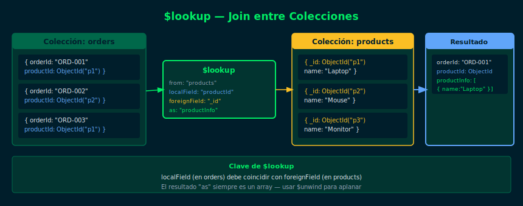

# $lookup — Joins entre Colecciones

**Semana 11 — $lookup y $unwind**



## Objetivos

- Entender qué es `$lookup` y para qué sirve
- Realizar joins simples con `localField` y `foreignField`
- Interpretar el array resultado del join
- Saber cuándo usar reference vs embed

## 1. ¿Qué es $lookup?

`$lookup` une documentos de dos colecciones, similar a un `JOIN` en SQL.
El resultado se agrega como un **array** en cada documento.

```js
// Estructura básica de $lookup
db.orders.aggregate([
  {
    $lookup: {
      from: "customers",       // colección a unir
      localField: "customerId", // campo en la colección actual
      foreignField: "_id",      // campo en la colección "from"
      as: "customerInfo"        // nombre del array resultante
    }
  }
])
```

## 2. Ejemplo Práctico

Con dos colecciones: `orders` (pedidos) y `products` (productos):

```js
// Obtener cada pedido con el detalle del producto
db.orders.aggregate([
  {
    $lookup: {
      from: "products",
      localField: "productId",
      foreignField: "_id",
      as: "product"
    }
  },
  { $project: { orderId: 1, quantity: 1, product: 1 } }
])
```

El campo `product` en cada documento de salida contiene un **array**
con los documentos coincidentes de `products`.

## 3. Resultado del $lookup

```js
// Documento de salida típico
{
  _id: ObjectId("..."),
  orderId: "ORD-001",
  quantity: 2,
  product: [                  // ← array con los docs coincidentes
    {
      _id: ObjectId("..."),
      name: "Laptop",
      price: 1200
    }
  ]
}
```

> Si no hay coincidencia, el array estará vacío: `product: []`

## 4. Filtrar resultados vacíos

```js
// Solo pedidos que tienen producto vinculado
db.orders.aggregate([
  {
    $lookup: {
      from: "products",
      localField: "productId",
      foreignField: "_id",
      as: "product"
    }
  },
  { $match: { product: { $ne: [] } } }
])
```

## Checklist

- ¿Entiendes qué significan `localField` y `foreignField`?
- ¿Sabes por qué el resultado de `$lookup` es un array?
- ¿Puedes filtrar documentos sin coincidencia con `$match`?
- ¿Reconoces cuándo usar `$lookup` en lugar de datos embebidos?

## Referencias

- [$lookup — MongoDB Docs](https://www.mongodb.com/docs/manual/reference/operator/aggregation/lookup/)
- [Aggregation Pipeline — MongoDB Docs](https://www.mongodb.com/docs/manual/aggregation/)
