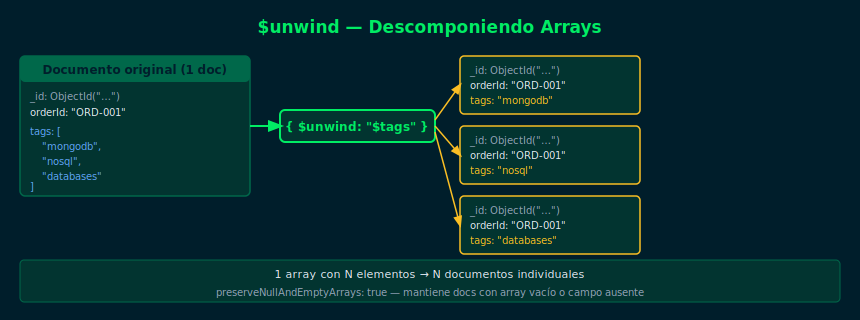

# $unwind — Descomponiendo Arrays

**Semana 11 — $lookup y $unwind**



## Objetivos

- Entender qué hace `$unwind` con los arrays de un documento
- Usar `$unwind` sobre arrays obtenidos con `$lookup`
- Combinar `$unwind` con `$group` para agregar datos
- Manejar arrays vacíos con `preserveNullAndEmptyArrays`

## 1. ¿Qué es $unwind?

`$unwind` toma un array en un documento y **crea un documento separado
para cada elemento del array**. Si el array tiene N elementos,
el resultado será N documentos.

```js
// Documento original
{ _id: 1, tags: ["mongodb", "nosql", "databases"] }

// Después de { $unwind: "$tags" }
{ _id: 1, tags: "mongodb" }
{ _id: 1, tags: "nosql" }
{ _id: 1, tags: "databases" }
```

## 2. $unwind sobre resultado de $lookup

El uso más común de `$unwind` es aplanar el array generado por `$lookup`:

```js
db.orders.aggregate([
  {
    $lookup: {
      from: "products",
      localField: "productId",
      foreignField: "_id",
      as: "product"
    }
  },
  // Aplanar el array de 1 elemento generado por $lookup
  { $unwind: "$product" },
  // Ahora "product" es un objeto, no un array
  { $project: { quantity: 1, "product.name": 1, "product.price": 1 } }
])
```

> Después de `$unwind`, el campo `product` es un **objeto** (no array),
> permitiendo acceder a sus campos con dot notation.

## 3. Opciones avanzadas de $unwind

```js
// Forma extendida con opciones
{ $unwind: {
    path: "$tags",
    includeArrayIndex: "tagPosition",    // incluir índice del array
    preserveNullAndEmptyArrays: true     // mantener docs con array vacío
} }
```

## 4. $unwind + $group: patrón frecuente

```js
// Contar cuántos pedidos tiene cada producto
db.orders.aggregate([
  { $lookup: { from: "products", localField: "productId",
               foreignField: "_id", as: "product" } },
  { $unwind: "$product" },
  { $group: {
      _id: "$product.name",
      totalOrders: { $sum: 1 },
      totalQuantity: { $sum: "$quantity" }
  }},
  { $sort: { totalOrders: -1 } }
])
```

## Checklist

- ¿Entiendes que $unwind multiplica documentos por cada elemento del array?
- ¿Sabes por qué $unwind se usa después de $lookup?
- ¿Puedes usar `preserveNullAndEmptyArrays` para no perder documentos?
- ¿Reconoces el patrón $lookup → $unwind → $group?

## Referencias

- [$unwind — MongoDB Docs](https://www.mongodb.com/docs/manual/reference/operator/aggregation/unwind/)
- [$lookup — MongoDB Docs](https://www.mongodb.com/docs/manual/reference/operator/aggregation/lookup/)
