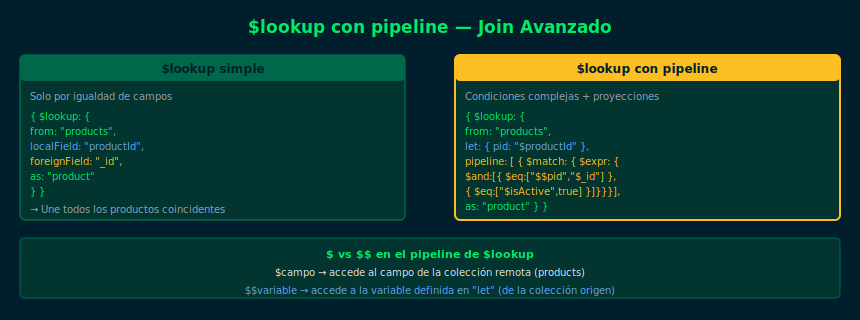

# $lookup con Pipeline — Joins Avanzados

**Semana 11 — $lookup y $unwind**



## Objetivos

- Usar la forma avanzada de `$lookup` con `pipeline` interno
- Filtrar y transformar documentos durante el join
- Realizar joins con condiciones complejas (múltiples campos)
- Comparar el $lookup simple vs $lookup con pipeline

## 1. $lookup con pipeline interno

La forma avanzada permite ejecutar un pipeline sobre la colección
remota **antes** de unir los documentos:

```js
db.orders.aggregate([
  {
    $lookup: {
      from: "products",
      let: { pid: "$productId" },          // variables locales
      pipeline: [
        { $match: { $expr: { $eq: ["$$pid", "$_id"] } } },
        { $project: { name: 1, price: 1, _id: 0 } }
      ],
      as: "product"
    }
  }
])
```

> `let` define variables con el valor del campo local.
> `$$variable` (doble `$`) accede a esas variables en el pipeline.

## 2. Filtrar durante el join

```js
// Obtener solo productos activos vinculados al pedido
db.orders.aggregate([
  {
    $lookup: {
      from: "products",
      let: { pid: "$productId" },
      pipeline: [
        {
          $match: {
            $expr: {
              $and: [
                { $eq: ["$$pid", "$_id"] },
                { $eq: ["$isActive", true] }
              ]
            }
          }
        }
      ],
      as: "activeProduct"
    }
  }
])
```

## 3. Cuándo usar cada forma

| Forma | Cuándo usar |
|-------|-------------|
| `$lookup` simple | Join directo por igualdad de un campo |
| `$lookup` con pipeline | Filtros adicionales, proyecciones, múltiples condiciones |

## 4. Optimización: índices en foreignField

Para que `$lookup` sea eficiente, el campo `foreignField` debe tener
un índice. Sin índice, MongoDB realizará un `COLLSCAN` en la colección
remota por cada documento de la colección origen.

```js
// Crear índice en la colección remota
db.products.createIndex({ _id: 1 })  // _id ya tiene índice automático
db.products.createIndex({ category: 1 })  // índice para joins por categoría
```

## Checklist

- ¿Entiendes la diferencia entre `$` y `$$` en el pipeline de $lookup?
- ¿Sabes cuándo preferir `$lookup` con pipeline sobre el simple?
- ¿Puedes filtrar documentos de la colección remota durante el join?
- ¿Identificas qué campo debería tener índice para optimizar el join?

## Referencias

- [$lookup con pipeline — MongoDB Docs](https://www.mongodb.com/docs/manual/reference/operator/aggregation/lookup/#join-conditions-and-subqueries-on-a-joined-collection)
- [$expr — MongoDB Docs](https://www.mongodb.com/docs/manual/reference/operator/query/expr/)
