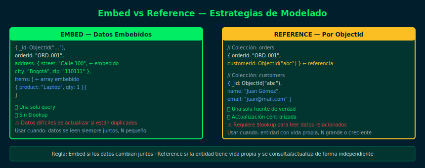

# Embed vs Reference — Estrategias de Modelado

**Semana 11 — $lookup y $unwind**



## Objetivos

- Distinguir entre documentos embebidos y referencias por ObjectId
- Aplicar el criterio correcto para elegir entre Embed y Reference
- Reconocer el costo de `$lookup` vs la redundancia de Embed
- Modelar casos de uso reales con la estrategia correcta

## 1. Embed — Documentos Anidados

Los datos relacionados se guardan **dentro** del mismo documento.

```js
// Pedido con dirección embebida
{
  _id: ObjectId("..."),
  orderId: "ORD-001",
  shippingAddress: {         // ← embebido
    street: "Calle 100",
    city: "Bogotá",
    zip: "110111"
  },
  items: [                   // ← array embebido
    { product: "Laptop", price: 1200, qty: 1 }
  ]
}
```

**Usar Embed cuando:**
- Los datos siempre se leen juntos
- La relación es 1:1 o 1:N con N pequeño y acotado
- Los subdocumentos no se consultan de forma independiente

## 2. Reference — ObjectId a otra Colección

Los datos relacionados se almacenan en otra colección,
y se usa un `ObjectId` como referencia.

```js
// Pedido con referencia al cliente
{ _id: ObjectId("..."), customerId: ObjectId("abc123"), total: 1200 }

// Cliente en su propia colección
{ _id: ObjectId("abc123"), name: "Juan Gómez", email: "juan@mail.com" }
```

**Usar Reference cuando:**
- Los datos relacionados se consultan/actualizan de forma independiente
- La relación es N:M o 1:N con N grande y creciente
- Los datos duplicados serían costosos de mantener actualizados

## 3. Comparativa de Decisión

| Criterio | Embed | Reference |
|----------|-------|-----------|
| Lectura | Sin join (1 query) | Requiere $lookup |
| Escritura | Actualizar doc padre | Actualizar solo la entidad |
| Crecimiento | Documento puede crecer indefinidamente | Solo la referencia |
| Consistencia | Manual si hay duplicación | Única fuente de verdad |

## 4. Regla Práctica

> **Embed**: datos que cambian juntos (dirección de envío de un pedido).  
> **Reference**: entidades con vida propia (cliente, producto, categoría).

## Checklist

- ¿Entiendes qué problema resuelve Reference frente a Embed?
- ¿Sabes cuándo embed genera documentos demasiado grandes?
- ¿Puedes identificar en tu dominio qué relaciones usan Reference?
- ¿Sabes que $lookup requiere índice en foreignField para buen rendimiento?

## Referencias

- [Data Modeling Introduction — MongoDB Docs](https://www.mongodb.com/docs/manual/core/data-modeling-introduction/)
- [Schema Design Patterns — Blog MongoDB](https://www.mongodb.com/blog/post/building-with-patterns-a-summary)
