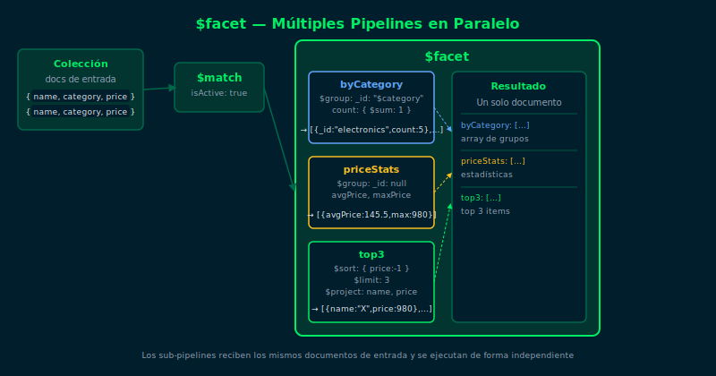

# `$facet` — Múltiples Pipelines en Paralelo

## Objetivos

- Entender qué es `$facet` y para qué sirve
- Ejecutar varios sub-pipelines dentro de una sola etapa
- Combinar `$facet` con `$match` para análisis multidimensional

## Diagrama



## 1. ¿Qué es `$facet`?

`$facet` ejecuta múltiples pipelines independientes sobre los **mismos documentos**
y devuelve un único documento con los resultados de cada pipeline.

```js
// Análisis multidimensional en una sola query
db.products.aggregate([
  { $match: { isActive: true } },
  {
    $facet: {
      byCategory: [
        { $group: { _id: "$category", count: { $sum: 1 } } }
      ],
      priceStats: [
        {
          $group: {
            _id: null,
            avgPrice: { $avg: { $toDouble: "$price" } },
            maxPrice: { $max: { $toDouble: "$price" } }
          }
        }
      ],
      top3: [
        { $sort: { price: -1 } },
        { $limit: 3 },
        { $project: { name: 1, price: 1, _id: 0 } }
      ]
    }
  }
])
```

## 2. Estructura de `$facet`

`$facet` recibe un objeto donde cada clave es el nombre del resultado
y el valor es un array de etapas de pipeline:

```js
{ $facet: {
    nombreResultado1: [ /* etapas */ ],
    nombreResultado2: [ /* etapas */ ],
    nombreResultado3: [ /* etapas */ ]
} }
```

El resultado es **siempre un único documento** con esos campos.

## 3. Restricciones importantes

- No se puede usar `$out` ni `$merge` dentro de un sub-pipeline de `$facet`
- No se puede usar `$facet` dentro de otro `$facet`
- Los documentos de entrada se pasan íntegros a cada sub-pipeline

## 4. Caso de uso típico: búsqueda con filtros

El patrón más común es combinar `$facet` con `$match` previo para obtener
resultados paginados y conteos de filtros disponibles al mismo tiempo:

```js
db.products.aggregate([
  { $match: { category: "electronics" } },
  {
    $facet: {
      results: [
        { $sort: { price: 1 } },
        { $skip: 0 },
        { $limit: 10 }
      ],
      totalCount: [
        { $count: "total" }
      ]
    }
  }
])
```

## Checklist

- ¿Puedes describir qué devuelve `$facet` (cuántos documentos)?
- ¿Qué pasa si el `$match` antes de `$facet` no encuentra nada?
- ¿En qué casos `$facet` es mejor que múltiples queries separadas?
- ¿Qué etapas NO se pueden usar dentro de un sub-pipeline de `$facet`?

## Referencias

- [$facet — MongoDB Docs](https://www.mongodb.com/docs/manual/reference/operator/aggregation/facet/)
- [Aggregation Pipeline — MongoDB Docs](https://www.mongodb.com/docs/manual/aggregation/)
