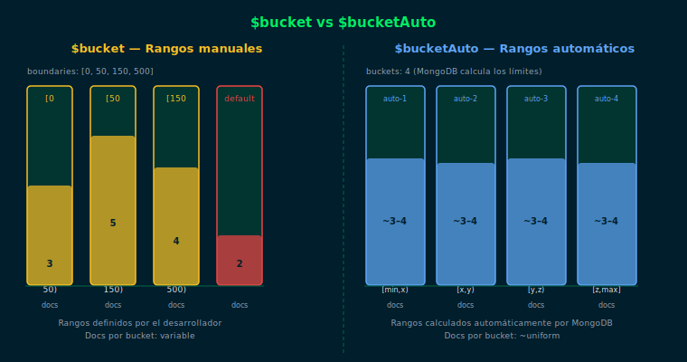

# `$bucket` y `$bucketAuto` — Rangos y Distribuciones

## Objetivos

- Agrupar documentos en rangos definidos con `$bucket`
- Dejar que MongoDB genere rangos automáticos con `$bucketAuto`
- Comparar ambos operadores y elegir el adecuado según el caso

## Diagrama



## 1. `$bucket` — Rangos manuales

`$bucket` clasifica documentos en grupos según rangos que defines tú.
Requiere un campo numérico y un array de límites (`boundaries`):

```js
// Clasificar productos por rango de precio
db.products.aggregate([
  {
    $bucket: {
      groupBy: { $toDouble: "$price" },
      boundaries: [0, 50, 150, 500, 2000],
      default: "otros",
      output: {
        count: { $sum: 1 },
        avgPrice: { $avg: { $toDouble: "$price" } },
        items: { $push: "$name" }
      }
    }
  }
])
```

Cada bucket representa un rango `[límite_N, límite_N+1)`:
- `[0, 50)` → precio menor a 50
- `[50, 150)` → precio entre 50 y 149.99
- `default` captura los que no entran en ningún rango

## 2. `$bucketAuto` — Rangos automáticos

`$bucketAuto` divide los documentos en N grupos iguales sin que definas límites:

```js
// Dividir en 4 grupos de igual tamaño automáticamente
db.products.aggregate([
  {
    $bucketAuto: {
      groupBy: { $toDouble: "$price" },
      buckets: 4,
      output: {
        count: { $sum: 1 },
        minPrice: { $min: { $toDouble: "$price" } },
        maxPrice: { $max: { $toDouble: "$price" } }
      }
    }
  }
])
```

## 3. Diferencias clave

| Aspecto | `$bucket` | `$bucketAuto` |
|---|---|---|
| Límites | Definidos por ti | Generados automáticamente |
| Cantidad de docs por grupo | Variable | Intentado uniforme |
| Campo `default` | Disponible | No disponible |

## 4. Combinando con `$facet`

```js
db.products.aggregate([
  {
    $facet: {
      byPriceRange: [
        {
          $bucket: {
            groupBy: { $toDouble: "$price" },
            boundaries: [0, 100, 500],
            default: "premium",
            output: { count: { $sum: 1 } }
          }
        }
      ],
      autoDistribution: [
        { $bucketAuto: { groupBy: { $toDouble: "$price" }, buckets: 5 } }
      ]
    }
  }
])
```

## Checklist

- ¿Qué ocurre si un documento tiene un valor fuera de todos los `boundaries`?
- ¿Qué diferencia hay en el resultado entre `$bucket` y `$bucketAuto`?
- ¿Por qué se usa `{ $toDouble: "$price" }` en vez de `"$price"` directamente?
- ¿En qué caso usarías `$bucketAuto` en lugar de `$bucket`?

## Referencias

- [$bucket — MongoDB Docs](https://www.mongodb.com/docs/manual/reference/operator/aggregation/bucket/)
- [$bucketAuto — MongoDB Docs](https://www.mongodb.com/docs/manual/reference/operator/aggregation/bucketAuto/)
