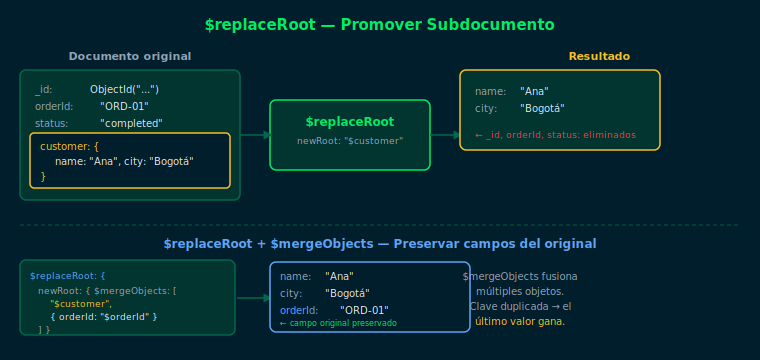

# `$replaceRoot` y `$replaceWith` — Reestructurar Documentos

## Objetivos

- Promover un subdocumento a la raíz del documento con `$replaceRoot`
- Usar `$mergeObjects` para combinar campos al reestructurar
- Entender la diferencia con `$project`

## Diagrama



## 1. ¿Qué hace `$replaceRoot`?

`$replaceRoot` reemplaza el documento actual por otro documento que especificas.
El uso más común es **promover un subdocumento embebido** a la raíz:

```js
// Documento original:
// { _id: 1, orderId: "ORD-01", customer: { name: "Ana", city: "Bogotá" } }

db.orders.aggregate([
  { $replaceRoot: { newRoot: "$customer" } }
])

// Resultado:
// { name: "Ana", city: "Bogotá" }
```

El `_id` y todos los campos del documento original desaparecen.
Solo quedan los campos del subdocumento promovido.

## 2. Combinar con `$mergeObjects`

Para preservar campos del documento original al promover el subdocumento:

```js
db.orders.aggregate([
  {
    $replaceRoot: {
      newRoot: {
        $mergeObjects: [
          "$customer",
          { orderId: "$orderId", status: "$status" }
        ]
      }
    }
  }
])

// Resultado: { name: "Ana", city: "Bogotá", orderId: "ORD-01", status: "completed" }
```

`$mergeObjects` fusiona múltiples objetos. Si hay claves duplicadas, gana la última.

## 3. `$replaceWith` — atajo de `$replaceRoot`

`$replaceWith` es un alias más conciso introducido en MongoDB 4.2:

```js
// Equivalentes:
{ $replaceRoot: { newRoot: "$customer" } }
{ $replaceWith: "$customer" }
```

## 4. Diferencia con `$project`

| Aspecto | `$replaceRoot` | `$project` |
|---|---|---|
| Resultado | Nuevo documento | Proyección del original |
| Campos excluidos | Todos los del original | Solo los que no especifiques |
| Caso de uso | Promover subdocumento | Filtrar/renombrar campos |

## Checklist

- ¿Qué sucede con el `_id` original cuando usas `$replaceRoot`?
- ¿Cuándo usarías `$mergeObjects` junto con `$replaceRoot`?
- ¿Cuál es la diferencia entre `$replaceRoot` y `$replaceWith`?
- ¿Qué pasa si el subdocumento que intentas promover no existe?

## Referencias

- [$replaceRoot — MongoDB Docs](https://www.mongodb.com/docs/manual/reference/operator/aggregation/replaceRoot/)
- [$mergeObjects — MongoDB Docs](https://www.mongodb.com/docs/manual/reference/operator/aggregation/mergeObjects/)
