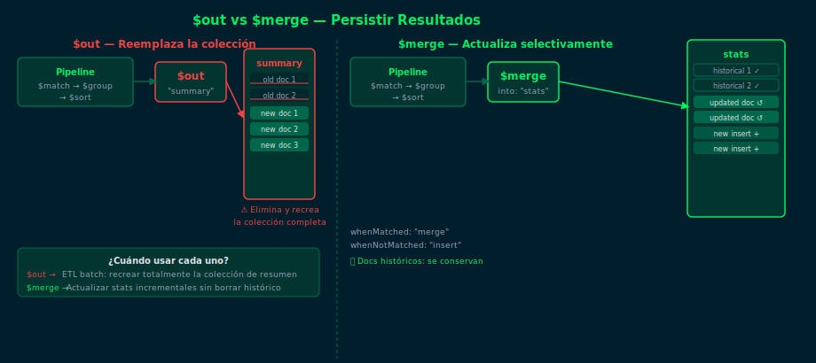

# `$merge` y `$out` — Persistir Resultados de Pipelines

## Objetivos

- Guardar resultados de un pipeline en una colección con `$out`
- Actualizar o insertar resultados incrementalmente con `$merge`
- Elegir entre `$out` y `$merge` según el caso de uso

## Diagrama



## 1. `$out` — Reemplazar colección completa

`$out` escribe el resultado del pipeline en una colección nueva o reemplaza una existente:

```js
// Guardar resumen de ventas por categoría
db.orders.aggregate([
  { $match: { status: "completed" } },
  {
    $group: {
      _id: "$category",
      totalSales: { $sum: { $toDouble: "$amount" } },
      count: { $sum: 1 }
    }
  },
  { $out: "sales_summary" }
])
```

> ⚠️ `$out` **elimina y recrea** la colección destino. No actualiza registros existentes.

## 2. `$merge` — Insertar o actualizar selectivamente

`$merge` es más flexible: puede insertar, reemplazar, fusionar o actualizar documentos
en la colección destino sin borrar los existentes:

```js
db.orders.aggregate([
  { $match: { status: "completed" } },
  {
    $group: {
      _id: "$agentId",
      totalRevenue: { $sum: { $toDouble: "$amount" } },
      txCount: { $sum: 1 }
    }
  },
  {
    $merge: {
      into: "agent_stats",
      on: "_id",
      whenMatched: "merge",
      whenNotMatched: "insert"
    }
  }
])
```

## 3. Opciones de `$merge`

| Opción `whenMatched` | Comportamiento |
|---|---|
| `"merge"` | Fusiona campos nuevos con los existentes |
| `"replace"` | Reemplaza el documento completo |
| `"keepExisting"` | No modifica el documento existente |
| `"fail"` | Lanza error si ya existe |

## 4. Cuándo usar cada uno

- `$out`: Recrear totalmente una colección de resumen (ETL batch)
- `$merge`: Actualizar stats incrementales sin perder datos históricos

## Checklist

- ¿Qué diferencia crítica hay entre `$out` y `$merge`?
- ¿Qué ocurre con los documentos existentes cuando usas `$out`?
- ¿Cuándo usarías `whenMatched: "merge"` vs `"replace"`?
- ¿Puede `$merge` escribir en otra base de datos?

## Referencias

- [$merge — MongoDB Docs](https://www.mongodb.com/docs/manual/reference/operator/aggregation/merge/)
- [$out — MongoDB Docs](https://www.mongodb.com/docs/manual/reference/operator/aggregation/out/)
