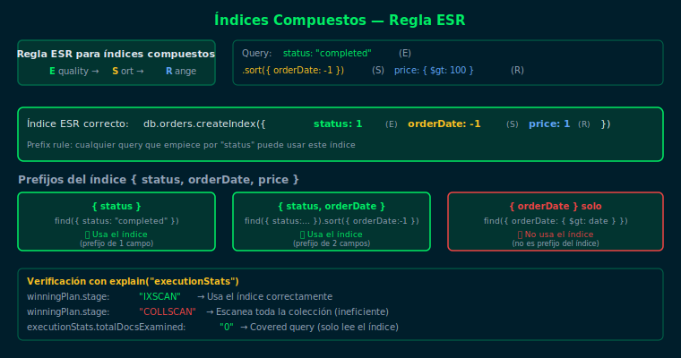

# Ejercicio 01 — Índices Compuestos y Covered Queries

## Objetivo

Practicar la creación de índices compuestos aplicando la regla ESR
(Equality → Sort → Range) y verificar covered queries con `explain()`.

## Diagrama de referencia



## Cómo ejecutar

1. Asegúrate de tener Docker corriendo
2. Levanta el contenedor:
   ```bash
   docker compose -f _scripts/docker-compose.yml up -d
   ```
3. Carga los datos de prueba:
   ```bash
   docker compose -f _scripts/docker-compose.yml exec -T mongodb \
     mongosh -u bootcamp -p bootcamp123 --authenticationDatabase admin \
     bootcamp_db --file /dev/stdin < starter/setup.js
   ```
4. Conecta e interactúa:
   ```bash
   docker compose -f _scripts/docker-compose.yml exec mongodb \
     mongosh -u bootcamp -p bootcamp123 --authenticationDatabase admin bootcamp_db
   ```

---

## Pasos del ejercicio

### Paso 1: Índice Compuesto Simple

Un índice compuesto mejora queries que filtran por más de un campo.
MongoDB puede usar un índice compuesto para queries que usan el prefijo del índice.

```js
// Crear índice en status y city
db.orders_idx.createIndex({ status: 1, city: 1 })

// Query que usa el índice (filtra ambos campos)
db.orders_idx.find(
  { status: "completed", city: "Bogotá" }
).explain("executionStats")
```

**Abre `starter/ejercicio.js`** y descomenta la sección PASO 1.

---

### Paso 2: Regla ESR

La regla ESR define el orden óptimo de campos en un índice compuesto:

- **E** — Equality: campos con filtro de igualdad exacta (`status: "completed"`)
- **S** — Sort: campos usados en `.sort()`
- **R** — Range: campos con operadores de rango (`$gte`, `$lt`)

```js
// Índice con regla ESR aplicada
// E = status | S = orderDate | R = amount
db.orders_idx.createIndex({
  status: 1,
  orderDate: 1,
  amount: 1
})
```

**Abre `starter/ejercicio.js`** y descomenta la sección PASO 2.

---

### Paso 3: Covered Query

Una **covered query** es aquella donde el índice contiene todos los campos
que se filtran Y todos los campos que se proyectan.
Resultado: `totalDocsExamined: 0` — MongoDB nunca lee el documento real.

```js
// El índice contiene: customerId, status, amount
// La proyección solo pide esos mismos campos + _id: 0
db.orders_idx.find(
  { status: "completed" },
  { customerId: 1, status: 1, amount: 1, _id: 0 }
).explain("executionStats")
// totalDocsExamined: 0 ← respuesta desde el índice puro
```

> ⚠️ `_id: 0` es obligatorio. Sin él, MongoDB intentaría incluir `_id`
> desde el documento, rompiendo la cobertura del índice.

**Abre `starter/ejercicio.js`** y descomenta la sección PASO 3.

---

### Paso 4: Estadísticas de uso de índices

`$indexStats` muestra cuántas veces fue utilizado cada índice.

```js
db.orders_idx.aggregate([{ $indexStats: {} }])
```

**Abre `starter/ejercicio.js`** y descomenta la sección PASO 4.

---

## Checklist

- [ ] ¿El `explain()` muestra `stage: "IXSCAN"` con el índice compuesto?
- [ ] ¿Puedes identificar los campos E, S y R en tu índice ESR?
- [ ] ¿El explain de la covered query muestra `totalDocsExamined: 0`?
- [ ] ¿Qué ocurre si agregas `_id: 1` (o lo omites) en la proyección?
