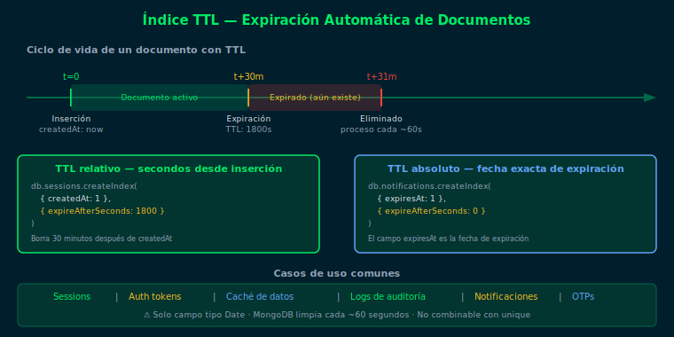
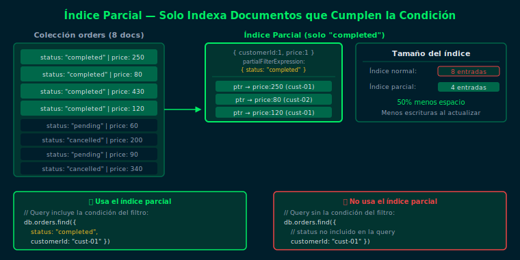
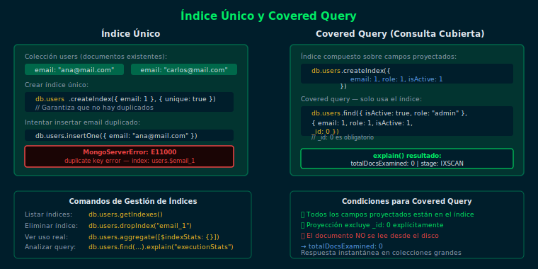

# Ejercicio 02 — TTL, Índices Parciales e Índices Únicos

## Objetivo

Crear y verificar índices TTL para expiración automática de datos,
índices únicos para integridad referencial e índices parciales para
optimizar colecciones con datos heterogéneos.

## Diagramas de referencia





## Cómo ejecutar

1. Asegúrate de tener Docker corriendo
2. Levanta el contenedor:
   ```bash
   docker compose -f _scripts/docker-compose.yml up -d
   ```
3. Carga los datos de prueba:
   ```bash
   docker compose -f _scripts/docker-compose.yml exec -T mongodb \
     mongosh -u bootcamp -p bootcamp123 --authenticationDatabase admin \
     bootcamp_db --file /dev/stdin < starter/setup.js
   ```
4. Conecta e interactúa:
   ```bash
   docker compose -f _scripts/docker-compose.yml exec mongodb \
     mongosh -u bootcamp -p bootcamp123 --authenticationDatabase admin bootcamp_db
   ```

---

## Pasos del ejercicio

### Paso 1: Índice TTL

Un índice TTL elimina documentos automáticamente tras `expireAfterSeconds`
segundos, contados desde el valor del campo `Date` indexado.

```js
// TTL relativo: eliminar 60 segundos después de createdAt
db.sessions.createIndex(
  { createdAt: 1 },
  { expireAfterSeconds: 60 }
)
```

> El monitor TTL de MongoDB corre cada ~60 segundos.
> El documento puede permanecer hasta 120 segundos en total.

**Abre `starter/ejercicio.js`** y descomenta la sección PASO 1.

---

### Paso 2: Índice Único

Garantiza que no existan dos documentos con el mismo valor en el campo indexado.

```js
db.users_idx.createIndex({ email: 1 }, { unique: true })

// Al intentar duplicar:
// MongoServerError: E11000 duplicate key error
```

**Abre `starter/ejercicio.js`** y descomenta la sección PASO 2.

---

### Paso 3: Índice Parcial

Solo indexa documentos que cumplen la `partialFilterExpression`.
La query DEBE incluir la condición del filtro para que MongoDB use el índice.

```js
db.users_idx.createIndex(
  { role: 1, registeredAt: 1 },
  {
    partialFilterExpression: { isActive: { $eq: true } },
    name: "idx_role_active_users"
  }
)
```

**Abre `starter/ejercicio.js`** y descomenta la sección PASO 3.

---

### Paso 4: Índice Sparse

Un índice sparse ignora documentos donde el campo indexado no existe.
Diferencia con parcial: el sparse solo filtra por `$exists`, no por valor.

```js
db.users_idx.createIndex(
  { username: 1 },
  { sparse: true, unique: true }
)
```

**Abre `starter/ejercicio.js`** y descomenta la sección PASO 4.

---

## Checklist

- [ ] ¿Creaste el TTL y verificaste con `getIndexes()` que `expireAfterSeconds` aparece?
- [ ] ¿El intento de insertar email duplicado lanzó el error E11000?
- [ ] ¿El `explain()` con `isActive: true` muestra IXSCAN y sin esa condición muestra COLLSCAN?
- [ ] ¿Puedes explicar la diferencia práctica entre `sparse` y `partialFilterExpression`?
