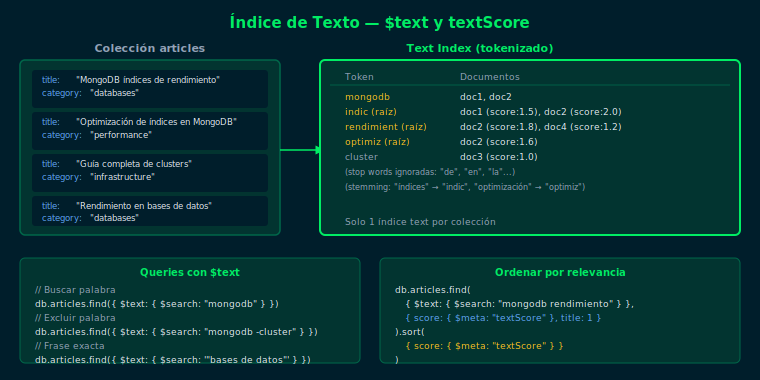
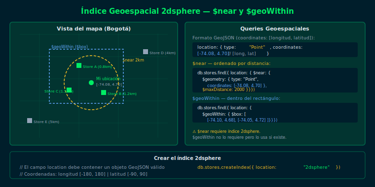

# Semana 14 — Índices de Texto y Geoespaciales

## Objetivos

- Crear índices de texto (`text`) y ejecutar búsquedas con `$text` y `$search`
- Aplicar los operadores `$near`, `$geoWithin` y `$geoIntersects` con índices `2dsphere`
- Controlar relevancia textual con `$meta: "textScore"` y el campo `$language`
- Combinar búsquedas geoespaciales con filtros normales de MongoDB

## Distribución del tiempo (8 horas)

| Actividad        | Tiempo estimado |
|------------------|----------------|
| Teoría           | 2 horas        |
| Ejercicio 01     | 1.5 horas      |
| Ejercicio 02     | 1.5 horas      |
| Proyecto         | 2 horas        |
| Glosario/Recap   | 1 hora         |

## Diagrama de referencia

## Contenido

### Teoría

1. [Índices de Texto — `$text` y `$search`](1-teoria/01-text-indexes.md)
2. [Operadores de texto — Score, Language, Phrase](1-teoria/02-text-operators.md)
3. [Índices Geoespaciales — `2dsphere`](1-teoria/03-geospatial-indexes.md)
4. [Operadores Geoespaciales — `$near`, `$geoWithin`](1-teoria/04-geo-operators.md)

### Prácticas

- [Ejercicio 01 — Búsquedas de Texto](2-practicas/ejercicio-01/README.md)
- [Ejercicio 02 — Consultas Geoespaciales](2-practicas/ejercicio-02/README.md)

### Proyecto

- [Proyecto Semanal](3-proyecto/README.md)

## Navegación

← [Semana 13 — Índices Avanzados](../week-13-indices_avanzados_compuestos_ttl_parciales_y_unicos/README.md) |
[Semana 15 — Patrones de Modelado →](../week-15-patrones_de_modelado_avanzado/README.md)
