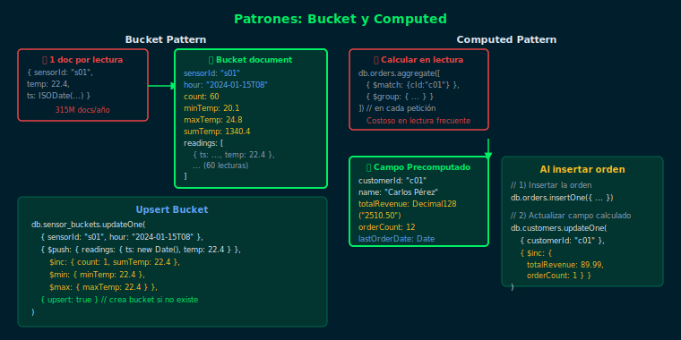

# 04 — Patrón Computed

## Objetivos

- Entender el costo de recalcular valores en lectura vs almacenarlos precomputados
- Calcular y actualizar campos derivados en el momento de la escritura
- Mantener la consistencia de los campos computados con `$set` en `updateOne`
- Identificar qué campos se benefician de precomputación vs pipeline on-demand

## Diagrama



---

## 1. El problema: calcular en cada lectura

Si `totalRevenue` se calcula sumando todos los items en cada consulta,
en colecciones grandes con miles de lecturas por segundo es costoso:

```js
// ❌ Calcular en cada lectura — costoso con alta concurrencia
db.orders.aggregate([
  { $match: { customerId: "cust-01" } },
  {
    $group: {
      _id: "$customerId",
      totalRevenue: { $sum: "$amount" }
    }
  }
])
```

---

## 2. La solución: precomputar al momento de escribir

```js
// ✅ El campo computado vive en el documento
{
  customerId: "cust-01",
  name: "Ana Torres",
  totalRevenue: 1250.50,   // precomputado
  orderCount: 7,           // precomputado
  lastOrderDate: ISODate("2024-04-22")
}
```

Al crear o actualizar un pedido, se actualiza el campo computado:

```js
// Al insertar un nuevo pedido, actualizar el perfil del cliente
db.orders.insertOne({ customerId: "cust-01", amount: Decimal128("85.00"), ... })

db.customers.updateOne(
  { customerId: "cust-01" },
  {
    $inc: { orderCount: 1 },
    $set: {
      lastOrderDate: new Date(),
      totalRevenue: 1335.50  // nuevo total calculado
    }
  }
)
```

---

## 3. Usando `$inc` para actualizar contadores

`$inc` aplica incrementos numéricos atómicos, ideal para contadores:

```js
// Incrementar orderCount y totalRevenue en una sola operación
db.customers.updateOne(
  { customerId: "cust-01" },
  {
    $inc: {
      orderCount: 1,
      totalRevenue: 85.00
    }
  }
)
```

---

## 4. Cuándo usar Computed

| Campo derivado            | ¿Precomputar?                      |
|---------------------------|------------------------------------|
| Total de pedidos          | ✅ Sí — se lee frecuentemente      |
| Promedio de calificaciones| ✅ Sí — operación costosa          |
| Edad (función de fecha)   | ❌ No — varía cada día             |
| Hash de contraseña        | ❌ Diferente propósito             |

---

## Checklist

- [ ] ¿Qué campos derivados calculas frecuentemente en lecturas?
- [ ] ¿Cómo actualizas el campo computado al insertar o modificar datos?
- [ ] ¿Preferiría `$inc` o `$set` para mantener el campo actualizado?
- [ ] ¿Qué ocurre si hay un error entre la escritura y la actualización del computado?

## Referencias

- [Computed Pattern — MongoDB Blog](https://www.mongodb.com/blog/post/building-with-patterns-the-computed-pattern)
