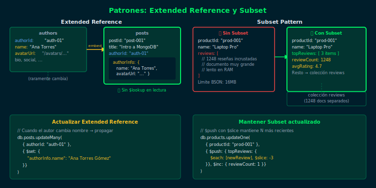

# Semana 15 — Patrones de Modelado Avanzado

## Objetivos

- Aplicar el patrón Extended Reference para evitar `$lookup` en datos leídos frecuentemente
- Usar el patrón Subset para almacenar solo los campos más relevantes en documentos embebidos
- Implementar el patrón Bucket para agrupar eventos en documentos contenedores (IoT, logs)
- Calcular y almacenar resultados precomputados con el patrón Computed

## Distribución del tiempo (8 horas)

| Actividad        | Tiempo estimado |
|------------------|----------------|
| Teoría           | 2 horas        |
| Ejercicio 01     | 1.5 horas      |
| Ejercicio 02     | 1.5 horas      |
| Proyecto         | 2 horas        |
| Glosario/Recap   | 1 hora         |

## Diagrama de referencia

## Contenido

### Teoría

1. [Patrón Extended Reference](1-teoria/01-extended-reference.md)
2. [Patrón Subset](1-teoria/02-subset-pattern.md)
3. [Patrón Bucket](1-teoria/03-bucket-pattern.md)
4. [Patrón Computed](1-teoria/04-computed-pattern.md)

### Prácticas

- [Ejercicio 01 — Extended Reference y Subset](2-practicas/ejercicio-01/README.md)
- [Ejercicio 02 — Bucket y Computed](2-practicas/ejercicio-02/README.md)

### Proyecto

- [Proyecto Semanal](3-proyecto/README.md)

## Navegación

← [Semana 14 — Índices de Texto y Geoespaciales](../week-14/README.md) |
[Semana 16 — Validación de Esquemas y Transacciones →](../week-16/README.md)
