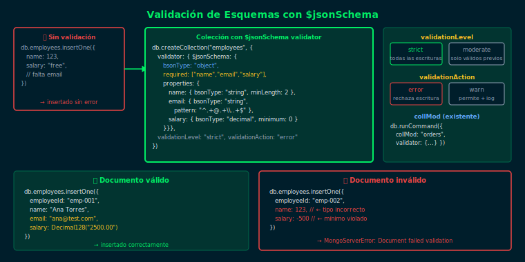

# 01 — Validación de Esquemas con `$jsonSchema`

## Objetivos

- Definir tipos, campos requeridos y restricciones con `$jsonSchema`
- Crear colecciones con `validator` desde el inicio
- Entender `validationLevel` y `validationAction`

## Diagrama



## 1. ¿Qué es la validación de esquemas?

MongoDB es flexible por defecto: cualquier documento puede insertarse en cualquier colección. `$jsonSchema` permite definir reglas que MongoDB verifica en cada escritura.

```js
// Crear colección con validación
db.createCollection("employees", {
  validator: {
    $jsonSchema: {
      bsonType: "object",
      required: ["employeeId", "name", "email", "salary"],
      properties: {
        employeeId: { bsonType: "string" },
        name:       { bsonType: "string", minLength: 2 },
        email:      { bsonType: "string", pattern: "^.+@.+\\..+$" },
        salary:     { bsonType: "decimal", minimum: 0 }
      }
    }
  }
})
```

## 2. Tipos BSON en `$jsonSchema`

| Tipo `bsonType` | Descripción |
|---|---|
| `"string"` | Texto |
| `"int"` | Entero 32 bits |
| `"long"` | Entero 64 bits |
| `"decimal"` | Decimal128 |
| `"bool"` | Booleano |
| `"date"` | Fecha BSON |
| `"array"` | Array |
| `"object"` | Subdocumento |

## 3. Niveles de validación y acción

```js
db.createCollection("products", {
  validator: { $jsonSchema: { ... } },
  validationLevel:  "strict",  // "strict" | "moderate"
  validationAction: "error"    // "error"  | "warn"
})
```

- **`strict`**: valida inserciones y actualizaciones en todos los documentos
- **`moderate`**: solo valida documentos que ya cumplen el esquema
- **`error`**: rechaza la operación (default)
- **`warn`**: permite la operación pero registra una advertencia en el log

## 4. Chequear si falla la validación

```js
// Falla: salary negativo
db.employees.insertOne({
  employeeId: "emp-001", name: "Ana", email: "ana@test.com",
  salary: Decimal128("-100")
})
// Document failed validation
```

## Checklist

- [ ] ¿Sabes qué campos acepta `properties` en `$jsonSchema`?
- [ ] ¿Cuándo conviene usar `validationLevel: "moderate"`?
- [ ] ¿Qué error lanza MongoDB al fallar la validación?
- [ ] ¿Cómo afecta `validationAction: "warn"` al comportamiento de la colección?

## Referencias

- [Schema Validation — MongoDB Docs](https://www.mongodb.com/docs/manual/core/schema-validation/)
- [$jsonSchema Keyword Reference](https://www.mongodb.com/docs/manual/reference/operator/query/jsonSchema/)
