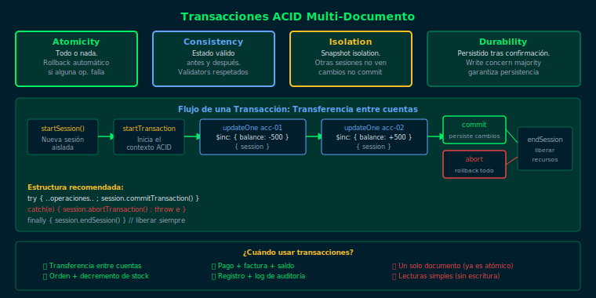

# 03 — Transacciones ACID en MongoDB

## Objetivos

- Comprender las 4 propiedades ACID y su implementación en MongoDB
- Iniciar una sesión y ejecutar una transacción multi-documento
- Confirmar (`commitTransaction`) o abortar (`abortTransaction`)

## Diagrama



## 1. ¿Qué es ACID?

| Propiedad | Significado | MongoDB |
|---|---|---|
| **A**tomicity | Todo o nada | Rollback automático si falla |
| **C**onsistency | Estado válido antes y después | Validadores + transacción |
| **I**solation | Las operaciones no se interfieren | Snapshot isolation |
| **D**urability | Los cambios persistidos sobreviven fallos | Write concern `majority` |

> MongoDB soporta transacciones multi-documento desde la versión 4.0 en Replica Sets y desde 4.2 en sharded clusters.

## 2. Estructura básica de una transacción

```js
const session = db.getMongo().startSession()
session.startTransaction()

try {
  const sOrders  = session.getDatabase("bootcamp_db").orders
  const sStock   = session.getDatabase("bootcamp_db").products

  // Insertar la orden
  sOrders.insertOne({
    orderId: "ord-txn-001",
    customerId: "cust-01",
    productId: "prod-01",
    quantity: NumberInt(2),
    amount: Decimal128("199.98"),
    status: "completed",
    createdAt: new Date()
  }, { session })

  // Decrementar el stock
  sStock.updateOne(
    { productId: "prod-01" },
    { $inc: { stock: -2 } },
    { session }
  )

  session.commitTransaction()
  print("Transacción confirmada.")
} catch (e) {
  session.abortTransaction()
  print("Transacción abortada: " + e.message)
} finally {
  session.endSession()
}
```

## 3. Puntos clave

- Todas las operaciones dentro de la transacción deben pasar la misma `{ session }`
- Si alguna operación falla, `abortTransaction()` revierte todas las anteriores
- Las transacciones tienen un tiempo límite de 60 segundos por defecto
- Usar transacciones agrega latencia: reservarlas para operaciones que lo requieran

## Checklist

- [ ] ¿Puedes crear y terminar una sesión correctamente?
- [ ] ¿Qué pasa si omites `{ session }` en una de las operaciones?
- [ ] ¿Cuándo se reversa automáticamente la transacción?
- [ ] ¿Por qué es recomendable el bloque `finally { session.endSession() }`?

## Referencias

- [Transactions — MongoDB Docs](https://www.mongodb.com/docs/manual/core/transactions/)
- [Multi-Document Transactions](https://www.mongodb.com/docs/manual/core/transactions-in-applications/)
