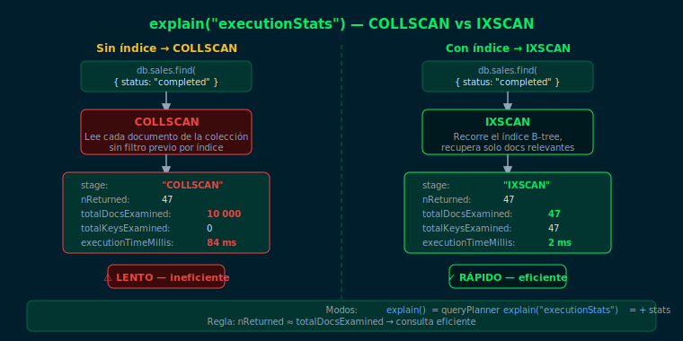

# explain() — Análisis de Consultas

## Objetivos
1. Ejecutar `explain()` en sus tres modos y leer la salida
2. Identificar el stage `COLLSCAN` como señal de consulta sin índice
3. Reconocer `IXSCAN` e `IDHACK` como stages eficientes
4. Interpretar los campos clave del plan de ejecución

---



## 1. ¿Por qué analizar consultas?

Una query sin índice realiza un `COLLSCAN`: revisa cada documento de la colección.
Con 10 000 documentos que devuelven 5 resultados, se examinan 10 000 docs
para retornar 5 — ineficiente.

`explain()` muestra exactamente qué hace MongoDB al ejecutar una consulta.

## 2. Modos de explain()

```js
// Modo 1: solo el plan elegido (sin ejecutar)
db.sales.find({ status: "completed" }).explain()

// Modo 2: estadísticas reales de ejecución
db.sales.find({ status: "completed" }).explain("executionStats")

// Modo 3: plan elegido + planes descartados con sus stats
db.sales.find({ status: "completed" }).explain("allPlansExecution")
```

## 3. Stages principales

| Stage | Significado |
|---|---|
| `COLLSCAN` | Recorre toda la colección — sin índice |
| `IXSCAN` | Recorre un índice B-tree — con índice |
| `IDHACK` | Búsqueda directa por `_id` — siempre eficiente |
| `FETCH` | Recupera documentos completos tras IXSCAN |
| `SORT` | Ordenamiento en memoria (costoso sin índice) |

## 4. Campos clave en executionStats

```js
{
  executionStats: {
    nReturned: 47,           // documentos devueltos al cliente
    totalKeysExamined: 47,   // entradas de índice recorridas
    totalDocsExamined: 47,   // documentos completos leídos
    executionTimeMillis: 2   // tiempo total en milisegundos
  }
}
```

> Regla: `nReturned ≈ totalDocsExamined` indica eficiencia.
> Si `totalDocsExamined >> nReturned`, la consulta necesita un índice.

## 5. COLLSCAN vs IXSCAN en la práctica

```js
// COLLSCAN: sin índice en el campo "status"
db.sales.find({ status: "completed" }).explain("executionStats")
// → stage: "COLLSCAN", totalDocsExamined: 10000, nReturned: 47

// Crear índice
db.sales.createIndex({ status: 1 })

// IXSCAN: con índice
db.sales.find({ status: "completed" }).explain("executionStats")
// → stage: "IXSCAN", totalDocsExamined: 47, nReturned: 47
```

## Checklist
- ¿Qué significa `COLLSCAN` en el plan de ejecución?
- ¿Cuál es la diferencia entre `totalDocsExamined` y `nReturned`?
- ¿Cuándo aparece `IDHACK` en lugar de `IXSCAN`?
- ¿Qué valores indican que una consulta es eficiente?

## Referencias
- [explain() — MongoDB Docs](https://www.mongodb.com/docs/manual/reference/method/cursor.explain/)
- [Query Plans — MongoDB Docs](https://www.mongodb.com/docs/manual/core/query-plans/)
