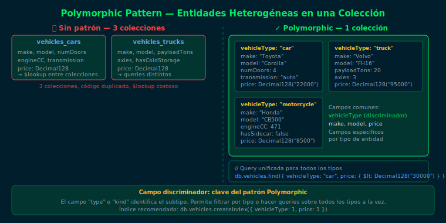

# Patrón Polymorphic

## Objetivos
1. Identificar cuándo entidades heterogéneas pertenecen a la misma colección
2. Usar un campo discriminador para diferenciar subtipos
3. Construir queries que funcionen sobre todos los tipos simultáneamente
4. Diseñar índices eficientes para colecciones polimórficas

---



## 1. ¿Qué problema resuelve?

Sin el patrón: 3 colecciones separadas (cars, trucks, motorcycles).
Un reporte de "todos los vehículos" requiere `$lookup` o queries múltiples.

Con el patrón: **1 colección** con un campo discriminador que identifica el tipo.

## 2. Estructura básica

```js
// Un solo campo identifica el subtipo
db.vehicles.insertMany([
  {
    vehicleType: "car",        // ← discriminador
    make: "Toyota", model: "Corolla",
    numDoors: NumberInt(4), transmission: "auto",
    price: Decimal128("22000.00")
  },
  {
    vehicleType: "truck",
    make: "Volvo", model: "FH16",
    payloadTons: NumberInt(20), axles: NumberInt(3),
    price: Decimal128("95000.00")
  }
])
```

## 3. Queries unificadas

```js
// Todos los vehículos bajo cierto precio
db.vehicles.find(
  { price: { $lt: Decimal128("30000.00") } },
  { vehicleType: 1, make: 1, model: 1, price: 1, _id: 0 }
)

// Solo un tipo
db.vehicles.find({ vehicleType: "car" })
```

## 4. Índices en colecciones polimórficas

```js
// Índice compuesto: tipo + campo de búsqueda frecuente
db.vehicles.createIndex({ vehicleType: 1, price: 1 })

// Índice sparse para campos que no existen en todos los tipos
db.vehicles.createIndex(
  { payloadTons: 1 },
  { sparse: true }   // solo indexa docs que tienen el campo
)
```

## Checklist
- ¿Qué campo actúa como discriminador en el patrón Polymorphic?
- ¿Cuándo conviene usar índices sparse en colecciones polimórficas?
- ¿Qué ventaja tiene una colección polimórfica sobre múltiples colecciones?
- ¿Qué pasa si una query no filtra por el discriminador?

## Referencias
- [Polymorphic Pattern — MongoDB Blog](https://www.mongodb.com/blog/post/building-with-patterns-the-polymorphic-pattern)
- [Schema Design Patterns Summary](https://www.mongodb.com/blog/post/building-with-patterns-a-summary)
