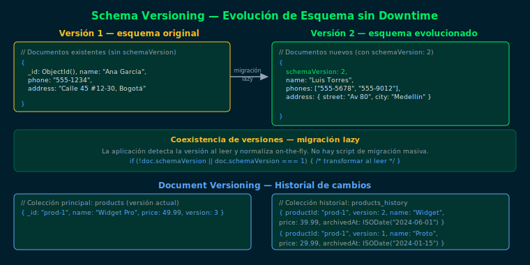

# Patrón Schema Versioning

## Objetivos
1. Comprender por qué los esquemas evolucionan en producción
2. Agregar un campo `schemaVersion` para rastrear la versión del esquema
3. Implementar migración lazy (on-read) sin downtime
4. Distinguir cuándo es necesaria una migración masiva vs lazy

---



## 1. El problema: esquemas cambian en producción

Con MongoDB es posible cambiar la estructura de documentos sin `ALTER TABLE`.
Pero si hay millones de documentos, una migración masiva puede ser costosa.

**Schema Versioning** permite que documentos con distintas versiones de
esquema coexistan pacíficamente.

## 2. Agregar schemaVersion

```js
// Documento nuevo con schemaVersion
db.contacts.insertOne({
  schemaVersion: NumberInt(2),
  name: "María López",
  phones: ["555-0001", "555-0002"],    // v2: array en lugar de string
  address: {
    street: "Cra 7 #45-20",
    city: "Bogotá"
  },
  updatedAt: new Date()
})
```

## 3. Migración lazy en la aplicación

```js
// Al leer, detectar versión y transformar
function normalizeContact(doc) {
  if (!doc.schemaVersion || doc.schemaVersion === 1) {
    // v1: phone era un string
    return {
      ...doc,
      schemaVersion: 2,
      phones: doc.phone ? [doc.phone] : [],
      address: { street: doc.address, city: "desconocido" }
    }
  }
  return doc    // v2: ya está en el formato correcto
}
```

## 4. Migración proactiva (batch)

Cuando la mayoría ya migró, actualizar el resto con `updateMany`:

```js
db.contacts.updateMany(
  { schemaVersion: { $exists: false } },
  [
    {
      $set: {
        schemaVersion: NumberInt(2),
        phones: { $cond: [{ $ifNull: ["$phone", false] }, ["$phone"], []] },
        updatedAt: "$$NOW"
      }
    },
    { $unset: "phone" }
  ]
)
```

## 5. Cuándo usar cada estrategia

| Estrategia | Cuándo |
|---|---|
| Lazy (on-read) | Colecciones grandes, cambio gradual |
| Batch migration | Cuando el campo viejo debe eliminarse |
| In-place (todo de una vez) | Colecciones pequeñas, downtime aceptable |

## Checklist
- ¿Qué campo indica la versión del esquema en un documento?
- ¿Qué significa "migración lazy" en el contexto de Schema Versioning?
- ¿Cuándo conviene hacer una migración masiva en lugar de lazy?
- ¿Qué stages de aggregation pipeline se usan en la migración batch?

## Referencias
- [Schema Versioning Pattern — MongoDB Blog](https://www.mongodb.com/blog/post/building-with-patterns-the-schema-versioning-pattern)
- [$set aggregation pipeline update](https://www.mongodb.com/docs/manual/reference/operator/update/set-aggregation-pipeline/)
