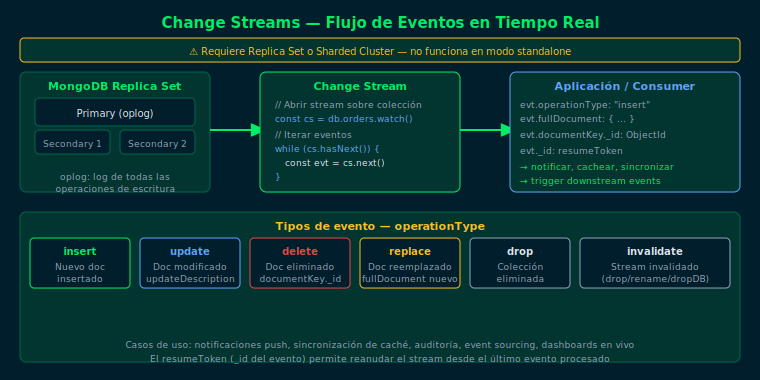

# watch() — Introducción a Change Streams

## Objetivos
1. Entender qué es un Change Stream y cómo se basa en el oplog
2. Abrir un stream sobre una colección con `watch()`
3. Leer eventos con `hasNext()` y `next()`
4. Identificar los campos principales de un evento de cambio

---



## 1. ¿Qué es un Change Stream?

MongoDB registra todas las escrituras en el **oplog** (operation log) del Primary.
Un Change Stream es una API que permite a las aplicaciones suscribirse a ese
flujo de eventos en tiempo real, sin polling.

> Requiere Replica Set o Sharded Cluster. No funciona en standalone.

## 2. Abrir un change stream básico

```js
// Stream sobre una colección específica
const changeStream = db.orders.watch()

// Stream sobre toda la base de datos
const dbStream = db.watch()

// Iterar eventos (bloquea hasta que llega un evento)
while (changeStream.hasNext()) {
  const event = changeStream.next()
  printjson(event)
}
```

## 3. Estructura de un evento de cambio

```js
{
  _id: { ... },              // resumeToken (para reanudar)
  operationType: "insert",   // tipo de operación
  ns: {
    db: "bootcamp_db",
    coll: "orders"
  },
  documentKey: { _id: ObjectId("...") },
  fullDocument: {            // documento completo (en insert)
    _id: ObjectId("..."),
    status: "pending",
    amount: 250
  }
}
```

## 4. Cerrar el stream

```js
// Siempre cerrar el stream al terminar
changeStream.close()
```

## 5. Cuándo usar Change Streams

- Notificaciones en tiempo real (nuevas órdenes, alertas de stock bajo)
- Sincronización entre sistemas (MongoDB → caché, MongoDB → Elasticsearch)
- Auditoría de cambios en datos sensibles
- Event sourcing y CQRS

## Checklist
- ¿Sobre qué estructura de MongoDB se basa internamente un Change Stream?
- ¿Qué método bloquea la ejecución hasta que llega un evento?
- ¿Qué campo del evento se usa para reanudar el stream?
- ¿Por qué Change Streams requiere Replica Set?

## Referencias
- [Change Streams — MongoDB Docs](https://www.mongodb.com/docs/manual/changeStreams/)
- [watch() Method](https://www.mongodb.com/docs/manual/reference/method/db.collection.watch/)
