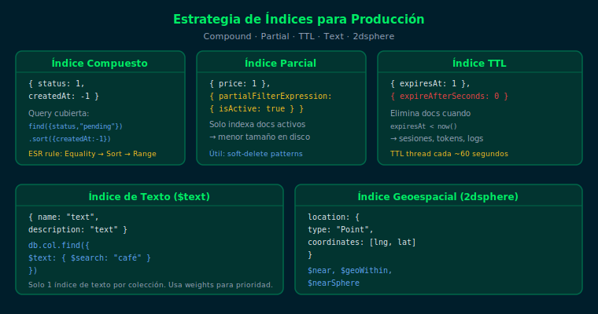

# Estrategia de Índices para Producción

> MongoDB 7.0 — Semana 24

## Objetivos

- Aplicar la regla ESR para índices compuestos
- Usar índices parciales y TTL para reducir espacio en disco
- Verificar cobertura de índices con `explain("executionStats")`

## Diagrama



## 1. Regla ESR (Equality → Sort → Range)

Para índices compuestos, ordena los campos según este criterio:

```js
// Query: igualdad en status, order por fecha, rango en precio
db.orders.createIndex({ status: 1, createdAt: -1, total: 1 })

db.orders.find({ status: "pending", total: { $gt: 100 } })
  .sort({ createdAt: -1 })
```

## 2. Índice parcial

Indexa solo los documentos que cumplan una condición:

```js
db.products.createIndex(
  { price: 1 },
  { partialFilterExpression: { isActive: true } }
)
```

Reduce el tamaño del índice vs. indexar toda la colección.

## 3. Índice TTL

Elimina documentos automáticamente cuando un campo `Date` alcanza el tiempo:

```js
db.sessions.createIndex(
  { expiresAt: 1 },
  { expireAfterSeconds: 0 }
)
```

Los documentos se eliminan cuando `expiresAt < new Date()`.

## 4. Verificar cobertura con explain()

```js
db.orders.find(
  { status: "pending" },
  { status: 1, createdAt: 1, _id: 0 }
).explain("executionStats")
```

Busca `"stage": "IXSCAN"` y `"totalDocsExamined": 0` para confirmar
que la query es cubierta completamente por el índice (covered query).

## Checklist

1. ¿Cuál es el orden correcto de campos en un índice ESR?
2. ¿Cuándo conviene un índice parcial sobre uno normal?
3. ¿Qué campo debe tener un índice TTL y de qué tipo BSON?
4. ¿Qué indica `totalDocsExamined: 0` en explain()?

## Referencias

- https://www.mongodb.com/docs/manual/indexes/
- https://www.mongodb.com/docs/manual/tutorial/create-indexes-to-support-queries/
