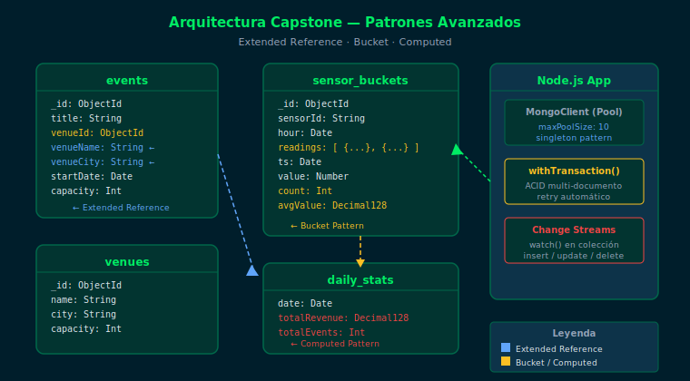

# Semana 24 — Proyecto Final Capstone

## Descripción

Semana final del bootcamp. Integras todos los conocimientos adquiridos en
24 semanas: modelado de datos con patrones avanzados, aggregation pipeline,
índices, transacciones multi-documento y MongoDB con Node.js.

## Objetivos

- Implementar al menos 2 patrones de diseño (Bucket, Extended Reference o Computed) en tu dominio
- Ejecutar transacciones multi-documento con `withTransaction()` en Node.js
- Construir un pipeline de agregación de 5+ etapas con `$lookup`, `$group`, `$facet`
- Aplicar estrategia de índices para cubrir las queries principales del dominio

## Distribución del Tiempo (8 horas)

| Actividad                          | Tiempo |
|------------------------------------|--------|
| Teoría: repaso de patrones         | 1.5 h  |
| Ejercicio 01: patrones de diseño   | 1.5 h  |
| Ejercicio 02: transacciones + Node | 1.5 h  |
| Proyecto capstone final            | 3.5 h  |

## Diagrama de Arquitectura



## Contenido

| Carpeta         | Descripción                                              |
|-----------------|----------------------------------------------------------|
| `0-assets/`     | Diagramas de arquitectura y patrones avanzados           |
| `1-teoria/`     | Repaso de patrones, transacciones, índices, producción   |
| `2-practicas/`  | Ejercicio 01 (patrones) + Ejercicio 02 (transacciones)   |
| `3-proyecto/`   | Proyecto capstone integrador                             |
| `4-recursos/`   | Recursos finales y hoja de ruta post-bootcamp            |
| `5-glosario/`   | Términos clave del bootcamp (repaso final)               |

## Cómo ejecutar

1. Asegúrate de tener Docker corriendo:
   ```bash
   docker compose -f _scripts/docker-compose.yml up -d
   ```
2. Instala dependencias Node.js:
   ```bash
   cd bootcamp/week-24-proyecto_final_capstone && npm install
   ```
3. Carga los datos de prueba:
   ```bash
   docker compose -f _scripts/docker-compose.yml exec -T mongodb \
     mongosh -u bootcamp -p bootcamp123 --authenticationDatabase admin \
     bootcamp_db --file /dev/stdin < 2-practicas/ejercicio-01/starter/setup.js
   ```
4. Conecta e interactúa:
   ```bash
   docker compose -f _scripts/docker-compose.yml exec mongodb \
     mongosh -u bootcamp -p bootcamp123 --authenticationDatabase admin bootcamp_db
   ```

## Prerrequisitos

- Haber completado las semanas 01–23
- Docker corriendo con MongoDB 7.0
- Node.js >= 18 con `mongodb@^6.0.0` instalado

## Navegación

- ← [Semana 23: MongoDB con Node.js](../week-23-mongodb_con_nodejs/README.md)
- ↑ [Índice del Bootcamp](../../_docs/README.md)
